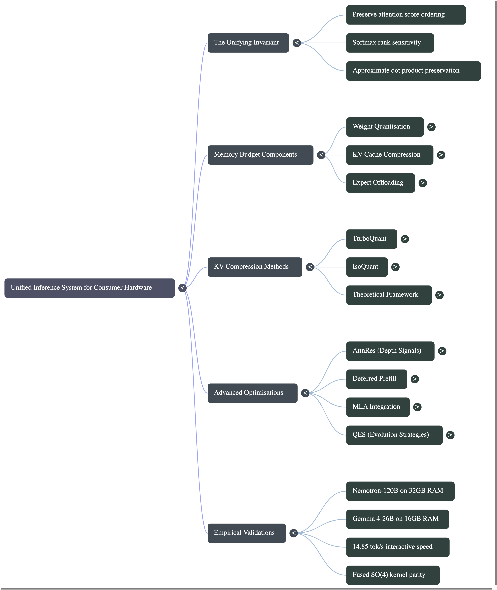
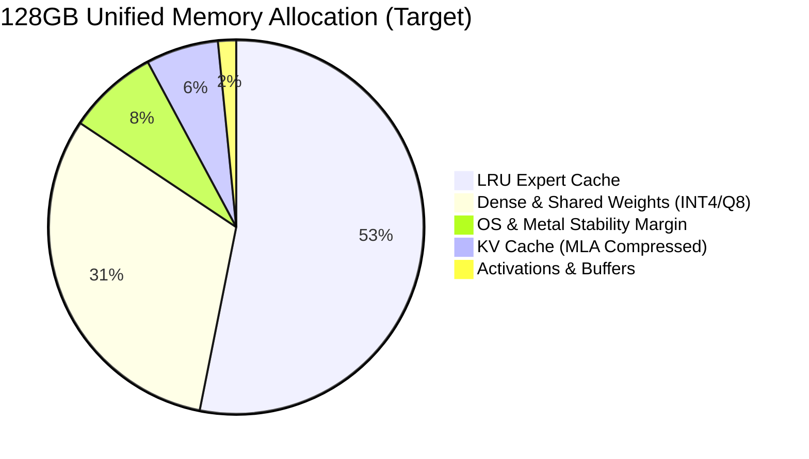
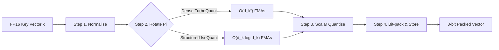
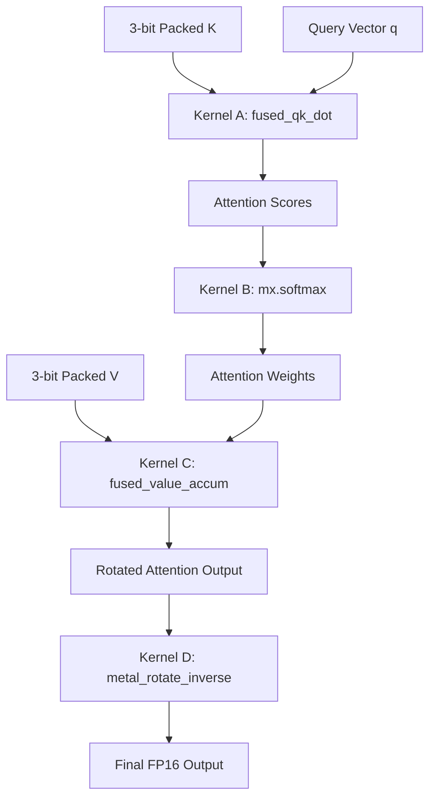
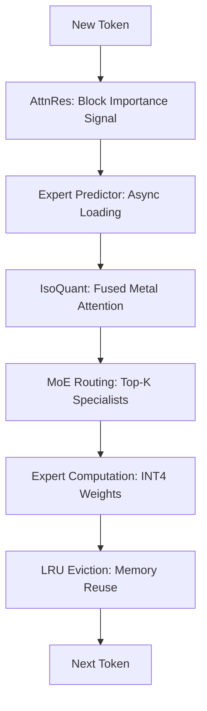

# Fused KV Cache Decode for Apple Silicon

**This repository implements a new execution model for attention: run attention directly on compressed KV cache -- no reconstruction, no GEMM, fully fused Metal kernels, with parallel Mojo kernel prototypes for portability.**


## TL;DR (Apple M4 Max)

- 120B model runs at **14.85 tok/s in 17.2 GB**
- KV cache compressed to **3-bit (5x smaller)**
- **No K/V reconstruction, no GEMM**
- **Fused Metal kernels (4 kernels total)**
- Quality parity with uncompressed KV (delta PPL +0.001)

| Method | KV Path | Gen (t/s) | Memory |
|--------|---------|-----------|--------|
| FP16 KV | Dequant + GEMM | ~100 | OOM at 120B |
| TurboQuant | Reconstruct + GEMM | 100.15 | High |
| **IsoQuant (this work)** | **Fused (no recon)** | **96.98** | **17.2 GB** |

---

Modern LLM inference is not compute-bound -- it is **memory-bandwidth bound**. The dominant cost is not attention itself, but reconstructing KV tensors before compute begins.

```
Standard execution model:
  compressed KV → dequantise → materialise FP16 tensors → GEMM → attention

IsoQuant execution model (this work):
  packed 3-bit KV → fused_qk_dot → softmax → fused_value_accum → inverse_rotate → output
  (no tensors materialised, no GEMM, data stays packed)
```

This repo implements that alternative pipeline:

- **Compute operates directly on compressed KV** -- no FP16 reconstruction
- **K/V tensors are never materialised** -- data stays in packed form
- **Attention executes in rotated space** -- inverse rotation applied once post-aggregation
- **Fused kernels replace GEMM** -- computation moves to the data, not vice versa
- **Structured rotation (WHT + SO(4))** reduces decode cost from O(d^2) to O(d log d)
- **Mojo prototypes** explore this execution model beyond Metal

Result: **14.85 tok/s on a 120B-parameter model within 17.2 GB** on an M4 Max. Validated with 12/12 correctness and a 2-hour soak test.

### Core Claim

This is not a quantisation improvement. It is a shift in execution model: from *reconstruct-then-compute* to *compute-in-compressed-space*.

---

## What's Different

```
Standard KV decode:
  K/V cache → dequantise → full matmul → softmax → full matmul → output

This repo:
  packed 3-bit KV → fused_qk_dot → softmax → fused_value_accum → inverse_rotate → output
                     (no K/V materialised)
```

| Method | Rotation | K/V materialised? | Decode FMAs | Stored params |
|--------|----------|-------------------|-------------|---------------|
| TurboQuant | Dense random | Yes (reconstruct) | O(d^2) | 16,384 |
| SpinQuant | Learned dense | Yes | O(d^2) | 16,384 |
| RotorQuant | Geometric algebra | No (claimed) | O(d log d) | ~256 |
| **IsoQuant (this work)** | **WHT + SO(4)** | **No (fused Metal)** | **O(d log d)** | **256** |

**TurboQuant** works today but pays O(d^2) decode cost and reconstructs tensors.
**RotorQuant** has better asymptotics but lacks production-grade fused kernels.
**IsoQuant** is the first systems-realised version: O(d log d) decode, fully fused Metal implementation, running on real models today.

---

## Key Insight

The bottleneck is not attention compute -- it is KV reconstruction.

Standard pipelines dequantise KV back to FP16, materialise full tensors, then run attention via GEMM. The reconstruction itself is the cost -- it saturates memory bandwidth before compute even begins.

This repo eliminates that step entirely. Attention runs directly on 3-bit packed data in registers. No tensors are materialised. No GEMM is called. Compute happens where data already is.

**This is a different execution model, not just a quantisation scheme.**

---

## The Fused Metal Pipeline

Four kernels, zero K/V reconstruction:

| Kernel | Operation | What it replaces |
|--------|-----------|------------------|
| **A: `fused_qk_dot`** | QK attention scores directly on 3-bit packed K | Dequant + matmul |
| **B: `mx.softmax`** | Standard softmax | (unchanged) |
| **C: `fused_value_accum`** | Weighted value sum on 3-bit packed V | Dequant + matmul |
| **D: `metal_rotate_inverse`** | WHT butterfly + SO(4) block inverse (1,408 FMAs) | Dense inverse (16,384 FMAs) |

These kernels are also prototyped in Mojo (`mojo-bench/`) to explore lower-level kernel optimisation and portability beyond Metal.

### The Real Bottleneck

> Kernel C (value accumulation) dominates runtime at **0.79 ms** -- more than Kernels A, B, and D combined.

This is not obvious. Most implementations assume QK matmul is dominant. In practice, with compressed KV, **value accumulation becomes the bottleneck** because each value must be decoded from 3-bit packed format and accumulated in a single pass.

We address this with a dual-strategy kernel:
- **Word-parallel** for short sequences (T < 512)
- **Dim-parallel** for long sequences (T >= 512)
- **Runtime auto-selection** via heuristic

### Verified on Apple M4 Max (Metal)

- Full GPU execution (no MLX fallback)
- Custom Metal kernels (no matmul / no gather)
- End-to-end correctness vs CPU reference: max error 3.8e-06

| Kernel | Description | Time (ms) |
|--------|------------|-----------|
| A | fused QK dot (3-bit decode) | 0.14--0.17 |
| B | softmax | 0.13--0.15 |
| C | fused value accumulation | **0.79 (dominant)** |
| D | WHT + SO(4) inverse | 0.11--0.14 |

---

## Why This Is Non-Trivial

This is not just quantisation:

- **3-bit values are bit-packed** -- must decode inside the kernel, not before it
- **No tensor materialisation** -- everything happens in registers
- **Rotation cannot be dense** -- replaced with WHT + SO(4) structured decomposition
- **GPU occupancy varies by regime** -- requires dual Kernel C strategies (short vs long sequence)

Even with emerging systems like Mojo, expressing these fused kernels requires careful control over memory layout, bit-packing, and warp-level execution -- this is not something standard matmul abstractions expose.

Most implementations avoid this by reconstructing tensors and calling GEMM. We explicitly avoid that.

---

## Why This Isn't Standard

Most systems do not fuse KV decode because:

1. **Bit-packed decode is hard to vectorise** -- 3-bit boundaries don't align with SIMD lanes
2. **Rotation breaks standard matmul assumptions** -- you can't call GEMM on rotated, packed data
3. **GPU kernels become occupancy-sensitive** -- different T regimes need different parallelism strategies
4. **Frameworks are built around GEMM abstractions** -- MLX, PyTorch, GGML all assume tensor materialisation

As a result, every existing system reconstructs tensors and calls GEMM.

IsoQuant instead moves compute into the decode path itself. The kernels decode, rotate, and accumulate in a single pass without ever materialising the full tensor.

---

## Results

| Model | tok/s | Peak Memory | Budget | Quality | 2h Soak |
|-------|-------|-------------|--------|---------|---------|
| **Gemma 4-26B** | 12.85 | 5.4 GB | 16 GB | 12/12 | RSS 1.18x |
| **Nemotron-H 120B** | 14.85 | 17.2 GB | 32 GB | 12/12 | RSS 0.994x |

### KV Fidelity -- IsoQuant vs TurboQuant vs Baseline

| Model | IsoQuant delta PPL | TurboQuant delta PPL |
|-------|--------------------|----------------------|
| Qwen3-30B-A3B | **+0.0009** | +0.0405 |
| Gemma 4-26B | **+0.0000** | +0.0622 |
| Nemotron-30B | **+0.0012** | +0.0039 |

IsoQuant achieves quality parity with uncompressed KV. TurboQuant does not.

### llama.cpp Integration

IsoQuant is integrated as `GGML_TYPE_ISOQUANT3_0` with a fused Metal shader (`kernel_turbo_wht_so4`). The fused kernel eliminates 280 extra kernel launches:

| Configuration | Prompt (t/s) | Gen (t/s) |
|---|---|---|
| turbo3 (baseline) | 4114.6 | 100.15 |
| **isoquant3 fused** | **4093.8 (-0.5%)** | **96.98 (-3.2%)** |
| isoquant3 composed (unfused) | 2306.2 (-44%) | 81.92 (-18%) |

The fused kernel recovers near-baseline throughput. The unfused path shows why fusion matters: **44% prompt regression without it.**

All measurements on Apple M4 Max (128 GB, 40 GPU cores, macOS 15.4). Pinned artifacts under `results/`.

### When This Wins

- **Long context (T >= 2K)** -- bandwidth savings compound with sequence length
- **Memory-bound regimes** -- when KV cache size dominates available bandwidth
- **Large models on constrained hardware** -- 120B in 17 GB, 26B in 5.4 GB

### When It Does Not

- **Short sequences** -- dispatch overhead dominates at low T
- **Small batch sizes** -- kernel launch cost amortises poorly
- **Highly optimised GEMM backends** -- if your backend already saturates ALUs, bandwidth isn't the bottleneck

This is a bandwidth optimisation, not a universal speedup. It matters most when KV cache is the wall.

### Scaling Intuition

KV bandwidth scales linearly with sequence length (T). IsoQuant reduces bytes-per-token by ~5x and decode compute from quadratic to sub-quadratic. **Gains increase with T** -- this is why it matters at 2K--32K context, not at 128.

---

## Quick Start

```bash
git clone https://github.com/2096955/RotaryQuant.git
cd RotaryQuant && pip install -e .          # isoquant CLI wrapper
cd mlx-lm && pip install -e .               # MLX inference engine
python -m mlx_lm.server --model <model> --kv-cache-type isoquant --port 8000
```

### Use with Claude Code

```bash
python -m mlx_lm.server --model <model> --kv-cache-type isoquant --port 8000 &
ANTHROPIC_BASE_URL=http://localhost:8000/v1 claude code
```

### Reproduce Benchmark

```bash
cd mlx-lm && pip install -e ".[test]"
python scripts/benchmark_fused_attention.py \
  --value-kernel auto \
  --bench-iters 100 \
  --json-out results.json
```

Expected output (M4 Max, H=8 T=2048 D=128):
```
fused_gpu_ms ≈ 0.9 ms
kernel_C    ≈ 0.8 ms  (dominant)
max_error   < 4e-06
```

---

## Repository Structure

| Directory | Contents |
|------------------|---------|
| `mlx-lm/` | MLX inference engine fork with IsoQuant KV cache + expert offload |
| `turboquant-mlx/` | KV compression library (codebooks, rotation matrices) |
| `mojo-bench/` | Mojo GPU kernel benchmarks (matmul, softmax, RoPE) |
| `scripts/` | Benchmark, comparison, validation, quality gate scripts |
| `results/` | Pinned benchmark artifacts and comparison outputs |
| `docs/` | Paper, benchmark spec, supporting documentation |
| `src/isoquant_mlx/` | CLI wrapper package (serve, validate, bench, convert) |

---

## Mojo Kernel Benchmarks

We include a parallel set of kernel implementations in Mojo (`mojo-bench/`) to study performance characteristics outside the MLX/Metal stack.

**Scope:** matmul baselines, softmax, RoPE / rotation kernels

**Purpose:**
- Validate kernel behaviour independent of MLX
- Explore portability to non-Metal backends
- Test lower-level optimisation strategies (tiling, memory layout, fusion)

Mojo is not used in the main inference path yet, but serves as a forward-looking kernel development environment.

---

## Roadmap

- [ ] llama.cpp full integration (`ggml-metal` backend, replace `ggml_compute_forward_flash_attn`)
- [ ] Single command-buffer fusion (remove remaining dispatch overhead)
- [ ] Kernel A+C fusion (eliminate intermediate score tensor)
- [ ] Larger context benchmarks (T >= 8K, T >= 32K)
- [ ] Mojo-native fused KV decode (portable backend beyond Metal)
- [ ] CUDA / Vulkan backend
- [ ] 1T-parameter validation on 128 GB hardware (Kimi-K2.5, 384 experts)

---

## Mind Map



---

# The Yum Cha Guide to Trillion-Parameter AI: A Conceptual Primer

**Podcast:** [Fitting a 120B Model on a MacBook — NotebookLM Breakdown](docs/Fitting_a_120B_model_on_a_MacBook.m4a) (download to listen)

**Video:** [AI & the Yum Cha Kitchen](docs/AI_&_the_Yum_Cha_Kitchen.mp4) (download to watch)

*Welcome to the kitchen of the future. As both a Distinguished Professor of Computer Architecture and a Michelin-starred Dim Sum Chef, I find that the most complex engineering challenges are best understood through the steam of a bamboo basket.*

Today, we face a "Kitchen Crisis." We have recipes for a trillion-parameter feast -- the world's most advanced Mixture-of-Experts (MoE) models -- but we are attempting to cook them in a standard home kitchen. This primer explains how we use architectural rigor and culinary finesse to make a 1T-parameter model fit on a consumer-grade counter.

---

## 1. The Great Kitchen Crisis: Why Large Models Don't Fit


*RAM is the counter space; the SSD is the back alley. A 1T-parameter model is 384 chefs trying to work in a space designed for eight.*

In the realm of AI, the "Kitchen" represents our total system, and the "Service Area" is our RAM (Random Access Memory). A 1-Trillion (1T) parameter model is a logistical nightmare: it is equivalent to 384 specialized station chefs trying to work simultaneously in a space designed for a single toaster.

The table below illustrates the mismatch between the "Ideal Kitchen Requirements" of a massive uncompressed model and the "Actual Counter Space" available on high-end consumer hardware, such as an Apple Silicon Mac with 128GB of Unified Memory.

| Ideal Kitchen Requirements (Uncompressed 1T Model) | Actual Counter Space (Consumer Apple Silicon) |
|----------------------------------------------------|-----------------------------------------------|
| All Expert Weights: ~800 GB (at FP16) | Total Memory Budget: 128 GB |
| Dense/Shared Weights: ~40 GB | Back Alley (Disk/NVMe): Multi-Terabyte |
| KV Cache (8K Context): ~8 GB | Operational Overhead: ~5 GB |

### The Unifying Invariant: Preserving the Order

To solve this, we do not need the chemical perfection of a laboratory; we need the preservation of rank order. In computer architecture, this is our "Unifying Invariant." The attention scores that drive Large Language Models are processed through a Softmax operator, which is highly sensitive to the relative ranking of ingredients (attention scores) rather than their absolute precision. As long as the most important flavors remain at the top of the profile, the final "dish" will be indistinguishable from the original.

To achieve this, we must rethink how we store recipes, rotate our staff, and pack our most delicate ingredients.

---

## 2. Meet the Staff: Mapping Technical Entities to the Kitchen

To run a kitchen of this scale, you must understand the hierarchy of the staff:

- **Tokens (The Customer Orders):** Every word entering the system is a new order requiring immediate processing.
- **RAM (The Counter Space):** The limited, high-speed area where active prep and cooking occur.
- **Disk/NVMe (The Back Alley):** Where off-duty staff and bulk supplies wait until the Floor Manager yells their name.
- **MoE Experts (The Station Chefs):** Specialists who only handle specific dishes. In a 1T model, we have 384 of these, but "Sparsity" dictates that only a few are active at once.
- **Shared Expert (The Kitchen Si Fu):** The master chef who oversees "common knowledge." This Si Fu touches every order to ensure consistency before it leaves the pass.

### The Si Fu's Special Treatment (Kurtosis and Outliers)


*The Si Fu touches every order. His weights stay at Q8_0 precision — full-text recipes, no shorthand.*

Based on our architectural data, the Shared Expert (Si Fu) carries a heavy informational load. We measure this through excess kurtosis -- a statistical indicator of "outlier values." The Si Fu exhibits an excess kurtosis of 10.10 compared to just 0.41 for the specialists -- a massive 24.6x gap. Because the Si Fu's knowledge is so "peaky" and outlier-dense, aggressive compression would destroy the flavor. Therefore, the Si Fu receives "prime counter space": we pin their weights at Q8_0 precision, while the specialists are sent to the alley and compressed far more aggressively.

---

## 3. Strategy I: Weight Quantisation (Shrinking the Recipe Cards)

The first step in saving space is shrinking the physical size of our instructions. Imagine the model's parameters as massive, multi-page recipe cards. If we keep every page in full detail (FP16), the counter overflows before the first order is even taken. Quantisation is the art of Shorthand. We compress these recipes into 4-bit or even 2-bit formats -- shortening instructions without losing the soul of the technique.

> *Chef's Intuition:* "We can afford to use shorthand for the specialists because they only do one thing. If the 'har gow' chef sees the note 'B3,' they know it means exactly 12 grams of prawn-and-bamboo filling with a translucent skin. But for the Si Fu, who balances the master stock and the overall harmony, we need the full text. If the Si Fu misses even one outlier ingredient due to messy handwriting, the entire service fails."

By using higher precision (Q8_0) for the high-kurtosis Shared Expert and aggressive 2-bit shorthand for the station chefs, we balance the memory budget without sacrificing the "snap" of the shrimp.

---

## 4. Strategy II: Expert Offloading (The Back-Alley Rotation)


*The Floor Manager (Router) calls the top-K specialists from the alley. The rest keep playing mahjong.*

In a standard Transformer kitchen, every chef must stay at their station, even if they aren't cooking. In an MoE kitchen, we utilize Sparsity. Out of 384 chefs, only 8 (Top-K) are active for any single token. The Floor Manager (Router) decides who is needed. The rest stay in the Back Alley (Disk).

| Standard Transformer | MoE with Offloading |
|---------------------|---------------------|
| Every chef stays in the kitchen at all times. | Most chefs wait outside in the Back Alley. |
| Result: Crowded, slow, and requires 800GB RAM. | Result: Lean floor, fits in 32GB-128GB RAM. |

We manage this via an LRU (Least Recently Used) Eviction policy. If the counter becomes too crowded, the Floor Manager sends the chef who has been idle the longest back to the alley to make room for fresh talent.

---

## 5. Strategy III: KV Cache Compression (The Siu Loong Bao Challenge)


*Each dumpling is stamped P3 (3-bit packed). 128 dimensions into 48 bytes — 5x compression without tearing the skin.*

The most demanding operation is managing the KV Cache, or "Prepped Fillings." As the conversation (sequence length) grows, the chef keeps more bowls of prepped ingredients on the counter. Eventually, the counter is covered in bowls, threatening to overflow. We solve this by packing these fillings like Siu Loong Bao (soup dumplings) through a 4-step pipeline:

1. **Normalise:** Weigh each filling batch so we know the proportions (mapping to the unit sphere).
2. **Rotate:** Evening out the portions so every dumpling is exactly the same size (Isotropic Transformation).
3. **Quantise:** Placing the fillings into 8 different-sized steamer baskets (Lloyd-Max Centroids).
4. **Bit-pack:** Stacking the baskets tightly into 3-bit integers to save 5x the space.

### The Steamer Basket Analogy (Lloyd-Max)

Lloyd-Max quantisation is a dual-optimization. We don't use the same size basket for everything. We use many small baskets for the common, small portions and a few large baskets for the rare outliers. This minimizes the "Crush Factor" (Distortion), ensuring that even when we stack them high, the delicate translucent har gow skin doesn't tear.

---

## 6. The Secret Sauce: IsoQuant and the Art of the "Two-Handed Mix"


*WHT global mix in the background vortex; SO(4) fine rotation distributes filling into groups of four.*

The secret to thin wrappers is Approximate Isotropy. If the fillings are lumpy and uneven, the wrappers will tear. We use IsoQuant, which evolved through three iterations of engineering struggle:

- **v1 (Single-handed mix):** Used a single-quaternion sandwich. It "collapsed," scoring 0/5 on our correctness tests because it left 25% of dimensions unmixed.
- **v2 (Isolated batches):** Block-diagonal rotation only. It was "degraded," scoring 1/5, as it failed to handle global correlations between ingredients.
- **v3 (The Current Default):** A "Global Rough Mix" (Walsh-Hadamard Transform) followed by a "Two-Handed Fine Mix" (SO(4) rotation). This is a non-negotiable architectural constraint for success.

| Metric | TurboQuant (Dense Rotation) | IsoQuant v3 (WHT + SO(4)) |
|--------|---------------------------|--------------------------|
| Theoretical FMAs | 16,384 | 1,408 (11x reduction) |
| Stored Parameters | 16,384 | 256 (64x reduction) |
| Memory Footprint | Large | Minimal |

> *The Thinner Paper Rule:* By ensuring the filling is perfectly even (Isotropy), the pressure of quantization error is spread across all dimensions. This allows us to use much thinner wrappers (3-bit) without the dumplings falling apart.

### Cleaning the Trays (The Inverse Rotation)


*Without scrubbing (inverse rotation), the coconut tarts taste of shrimp. Perplexity explodes from 7.05 to 15,369.*

Crucially, IsoQuant requires an Inverse Rotation at the read step. Think of this as scrubbing the steamer trays clean. If you move from a savory shrimp filling to a sweet coconut tart without scrubbing (reversing the rotation), the flavors contaminate each other. Without this step, perplexity explodes from 7.05 to 15,369 -- the coconut tarts taste of shrimp, and the model collapses.

---

## 7. Service Operations: Deferred Prefill and AttnRes

Even with the best prep, the timing of the service matters:

- **Deferred Prefill:** Instead of wrapping dumplings one by one during a rush (which causes compounding error), we keep ingredients fresh and wrap them all at once in a "bulk compress" when the initial rush is over.
- **AttnRes (Tasting as you go):** A cross-layer signal that lets the head chef taste the dish mid-prep to see which layers/blocks are most important.

> *Note: The Causal Property of AttnRes.* This signal is available before the Floor Manager calls the chefs. It allows us to know which station chefs will be needed next, providing a predictive prefetch signal that could -- in theory -- speed up the rotation.

> *A Warning from the Chef:* While the AttnRes signal is clever, the "management cost" of listening to it currently slows down the kitchen. We've measured a -11.2% throughput regression on Gemma 4 and -10.6% on Qwen3. For now, it remains an "optional garnish" rather than a main ingredient.

---

## 8. The Results: A Successful Service at 120B Scale

We have proven this "Three-Axis" approach works at massive scale, running a 120B parameter model on a budget that once seemed impossible.

| Model | tok/s | Peak Memory | Quality | Soak |
|-------|-------|-------------|---------|------|
| Gemma 4-26B | 12.85 `████░░░░░░` | 5.4 GB | 12/12 | 2 h pass |
| Nemotron-H 120B | 14.85 `█████░░░░░` | 17.2 GB | 12/12 | 2 h pass |

**Stability Note:** During a 2-hour soak test of the 120B model, we observed zero evictions and a stable RSS of 0.994x, proving the system can handle a full dinner service without a single dropped plate.

### The Scaling Gap: Moving to 1T

As we scale to the 1T-parameter "Grand Hall," our analysis shows the memory math holds firm. On a 128GB machine, the expert cache has enough room for 67,500 slots, providing roughly 3x headroom for the "Working Set" of active chefs.

> *The MLA/DKV Constraint:* For models using Multi-Head Latent Attention (MLA), such as Kimi-K2.5, we follow a non-negotiable rule: RoPE dimensions cannot be rotated or quantised. Rotating these positional phase dimensions would make the model attend to the right dish but forget which table ordered it.

**Conclusion:** By shrinking our recipes, rotating our staff, and mastering the art of the soup dumpling, we have turned the impossible into reality. Interactive, trillion-parameter AI is no longer a dream for supercomputers -- it is a dish we can now serve in a home kitchen.

---

---

# Full Technical Paper

**From Attention to Consumer Hardware: How MoE routing sparsity, isometric KV compression, and cross-layer attention signals compose into a unified inference system**

> *For the complete paper with all mathematical derivations, proofs, empirical results, and appendices, see [docs/FROM_ATTENTION_TO_CONSUMER_HARDWARE.md](docs/FROM_ATTENTION_TO_CONSUMER_HARDWARE.md).*

---

## The Unifying Invariant

The entire system is designed around one principle: **preserve the ordering of attention scores under constrained memory and bandwidth.** Softmax is invariant to additive shifts but highly sensitive to rank ordering -- making top-$k$ preservation more critical than mean-squared error (MSE). Every component serves this invariant: KV compression preserves approximate dot products, isotropy-inducing rotations ensure error stability, AttnRes identifies which computations matter, and MoE sparsity reduces the active parameter set.

---

## Standard Attention


*The Head Chef holds a fresh order ticket and scans every labelled steamer basket — that's $QK^\top$ in a single glance.*

Every transformer layer begins here. Given a sequence of token embeddings, we project into queries, keys, and values:

$$Q = XW_Q, \quad K = XW_K, \quad V = XW_V$$

where $X \in \mathbb{R}^{T \times d_{\text{model}}}$ and each projection $W \in \mathbb{R}^{d_{\text{model}} \times d_k}$. The attention output is:

$$\text{Attention}(Q, K, V) = \text{softmax}\!\left(\frac{QK^\top}{\sqrt{d_k}}\right) V$$

The softmax operates row-wise. For query position $i$, the attention weights over all key positions $j = 1, \ldots, T$ are:

$$a_{ij} = \frac{\exp(q_i^\top k_j / \sqrt{d_k})}{\sum_{m=1}^{T} \exp(q_i^\top k_m / \sqrt{d_k})}$$

The output for position $i$ is the weighted sum $o_i = \sum_j a_{ij} \, v_j$.

**The memory problem is immediate.** During autoregressive generation, every past token's key and value vectors must be retained -- the KV cache. For $L$ layers, $H$ heads, sequence length $T$, and head dimension $d_k$:

$$\text{KV memory} = 2 \times L \times H \times T \times d_k \times \text{bytes per element}$$

At FP16 (2 bytes), a 60-layer model with $d_k = 128$ and 8K context already demands gigabytes of KV storage alone.

---

## Mixture-of-Experts

A Mixture-of-Experts layer replaces the single FFN with $E$ parallel expert networks and a gating function $G$:

$$G(x) = \text{softmax}(W_g \, x) \in \mathbb{R}^E$$

$$\text{MoE}(x) = \sum_{e \in \text{TopK}(G(x))} G(x)_e \cdot f_e(x)$$

Only the top-$K$ experts (typically $K = 2$ or $K = 8$) are activated per token. A model with $E = 384$ experts and $K = 8$ activates only ~2% of expert parameters per token. The model has 1 trillion total parameters, but only ~3B are active at any moment.

Some architectures include a shared expert $f_{\text{shared}}$ that is always active:

$$\text{MoE}(x) = f_{\text{shared}}(x) + \sum_{e \in \text{TopK}(G(x))} G(x)_e \cdot f_e(x)$$

---

## The Memory Budget Problem



Three independent compression axes address three independent memory consumers:

**Weight quantisation** -- compress the model parameters (expert and dense weights). **KV cache compression** -- compress the attention state (keys and values stored per token). **Expert offloading** -- exploit routing sparsity to keep only active experts in RAM.

---

## KV Cache Compression Pipeline

Both TurboQuant and IsoQuant follow the same four-stage pipeline for compressing key vectors:



**Step 1. Normalise.** Map to the unit sphere: $\hat{k} = k / \|k\|_2$.

**Step 2. Rotate.** Apply an isometric transformation to spread correlated dimensions uniformly: $\tilde{k} = \Pi(\hat{k})$.

**Step 3. Scalar quantise.** Each dimension is quantised using Lloyd-Max optimal codebooks. The objective minimises total distortion:

$$D = \sum_{i=1}^{2^b} \int_{b_{i-1}}^{b_i} (x - c_i)^2 \, p(x) \, dx$$

with the nearest-neighbour condition:

$$b_i = \frac{c_i + c_{i+1}}{2}$$

and the centroid condition:

$$c_i = \frac{\int_{b_{i-1}}^{b_i} x \, p(x) \, dx}{\int_{b_{i-1}}^{b_i} p(x) \, dx}$$

**Step 4. Bit-pack and store.** At 3-bit, 128 dimensions pack into 48 bytes -- versus 256 bytes at FP16. A ~5x compression.

---

## IsoQuant: WHT + SO(4)

IsoQuant partitions the $d_k$-dimensional vector into groups of 4 and rotates each block using paired quaternions:

$$\tilde{k}_{[i]} = \mathfrak{q}_{L,i} \otimes \hat{k}_{[i]} \otimes \bar{\mathfrak{q}}_{R,i}$$

The full pipeline is a global Walsh-Hadamard pre-mixing, then SO(4) block rotation:

$$\tilde{k} = \Pi_{\text{SO}(4)}(H_d \cdot \hat{k})$$

where $H_d$ is the normalised Walsh-Hadamard matrix.

### Error Bound

$$\mathbb{E}[|q^\top k - \widehat{q^\top k}|^2] \leq d_k \sigma_q^2 \|q\|_2^2$$

The isometric rotation preserves inner products:

$$q^\top k = (Rq)^\top (Rk)$$

This allows the inverse rotation to be applied **once** on the aggregated attention output rather than per-token.

### Amortised Decode Cost

$$\text{IsoQuant read cost} = O(T \cdot d_k) + O(d_k \log d_k)$$

$$\text{TurboQuant read cost} = O(T \cdot d_k + d_k^2)$$

### Fused Metal Decode Pipeline



Kernel D uses 1,408 FMAs (896 WHT butterfly + 512 SO(4) block matvecs) versus 16,384 for a dense inverse rotation.

| Property | TurboQuant | IsoQuant v3 (WHT + SO(4)) | Notes |
|---|---|---|---|
| Theoretical structured FMAs | 16,384 | 1,408 | Requires fused kernels |
| Actual write path FMAs | 16,384 | 16,384 | Both dense today |
| Decode read path | Dense reconstruct | Fused Metal pipeline | No K/V materialisation |
| Stored parameters | 16,384 | 256 | 64x fewer parameters |

### Inverse Rotation

IsoQuant's block-diagonal quaternion rotations are not self-cancelling. The inverse must be applied explicitly:

$$\hat{v}_{\text{reconstructed}} = \bar{\mathfrak{q}}_{R,i} \otimes \tilde{v}_{[i]} \otimes \mathfrak{q}_{L,i}$$

Without the explicit inverse, perplexity explodes from 7.05 to 15,369.

---

## llama.cpp Integration

IsoQuant is integrated as `GGML_TYPE_ISOQUANT3_0` with dedicated Metal shaders. The fused `kernel_turbo_wht_so4` eliminates all dispatch overhead (280 extra kernel launches to 0):

| Configuration | Prompt (t/s) | Gen (t/s) | Source |
|---|---|---|---|
| turbo3 | 4114.6 | 100.15 | Pinned artifact |
| isoquant3 fused | 4093.8 (-0.5%) | 96.98 (-3.2%) | Pinned artifact |
| isoquant3 composed | 2306.2 (-44%) | 81.92 (-18%) | Pinned artifact |

---

## Empirical Results

### Pathway Proofs

| Model | Quality | tok/s | Peak Memory | Budget | 2h Soak | Status |
|-------|---------|-------|-------------|--------|---------|--------|
| **Gemma 4-26B** (layer-aware) | 12/12 | 12.85 `████░░░░░░` | 5.4 GB | 16 GB | P99/P50 1.29, RSS 1.18x | **Proven** |
| **Nemotron-H 120B** (mixed) | 12/12 | 14.85 `█████░░░░░` | 17.2 GB | 32 GB | P99/P50 1.14, RSS 0.994x | **Proven** |
| Nemotron-H 30B (mixed) | 10/12 | 35.5 `██████████` | 4.3 GB | 32 GB | P99/P50 1.16, RSS 1.03x | Blocked on quality |
| Qwen3-30B-A3B (4-bit) | 8/12 | 9.87 `███░░░░░░░` | 9.5 GB | 16 GB | -- | Blocked on quality |

### KV Fidelity (PPL at Fixed Depth)

| Model | backend | PPL @ 512 | PPL @ 2048 | Delta @ 2048 |
|---|---|---|---|---|
| **Qwen3-30B-A3B** | default | 1.3829 | 1.0844 | -- |
| | turboquant | 1.4497 | 1.1249 | +0.0405 |
| | isoquant | 1.3872 | 1.0853 | **+0.0009** |
| **Gemma 4-26B-A4B** | default | 3.2029 | 1.3483 | -- |
| | turboquant | 3.5180 | 1.4105 | +0.0622 |
| | isoquant | 3.2029 | 1.3483 | **+0.0000** |
| **Nemotron-30B** | default | 1.3911 | 1.0866 | -- |
| | turboquant | 1.4086 | 1.0905 | +0.0039 |
| | isoquant | 1.3961 | 1.0878 | **+0.0012** |

### Decode Profiling

| Component | Gemma4 (ms/tok) | Qwen3 (ms/tok) | Nemotron (ms/tok) |
|---|---|---|---|
| kv_attention | 65.3 `█████░░░░░` (51%) | 58.1 `█████░░░░░` (54%) | 6.6 `█░░░░░░░░░` (14%) |
| routed_expert | 47.5 `████░░░░░░` (37%) | 48.3 `█████░░░░░` (45%) | 28.7 `██████░░░░` (60%) |
| dense_ffn | 11.5 `█░░░░░░░░░` (9%) | 0.0 `░░░░░░░░░░` (0%) | 0.0 `░░░░░░░░░░` (0%) |
| other (Mamba/SSM) | 0.0 `░░░░░░░░░░` (0%) | 0.0 `░░░░░░░░░░` (0%) | 11.3 `██░░░░░░░░` (24%) |

KV attention is **51-54% of decode time** on standard MoE architectures (Gemma4, Qwen3), confirming it as the single largest cost center and justifying KV compression work. On hybrid Mamba+MoE (Nemotron-H), attention drops to 14% and expert routing dominates at 60%.

---

## The Full Stack



**Core stack** (implemented, produces artefacts): Expert offloading with LRU and `ensure_loaded()`. IsoQuant (WHT + SO(4)) KV compression on Apple Silicon Metal. Fused 4-kernel Metal decode pipeline operating directly on 3-bit packed data. Inverse rotation moved after attention sum. Deferred prefill with bulk compression. Mixed-precision weight quantisation (4-bit dense, 2-bit experts, Q8_0 shared).

**Optional enhancements** (implemented, not enabled by default): AttnRes predictor (`--use-predictor`) -- throughput regression prevents it from being a net win on constrained hardware. Task-aware pinning -- 0% hit-rate improvement.

### Go/No-go Decisions (April 2026)

| Component | Decision | Rationale |
|---|---|---|
| IsoQuant (WHT + SO(4)) | **Go** | Quality parity with default (delta PPL ~ 0), 64x fewer parameters |
| Fused Metal pipeline (MLX) | **Go** | Verified by 9 correctness tests, eliminated materialisation |
| IsoQuant (llama.cpp) | **Active** | Fused kernel recovers near-turbo3 throughput |
| Deferred prefill | **Go** | Eliminates compounding error; ~512 MB buffer is manageable |
| Gemma4 pathway | **Go** | All gates pass at 12.85 tok/s within 16GB budget |
| Nemotron-120B pathway | **Go** | All gates pass at 14.85 tok/s within 32GB budget |
| Qwen3 pathway | **Blocked** | Quality issues (8/12) |
| AttnRes predictor | **No-go** | 10.6-11.2% throughput regression with no hit-rate improvement |
| Task-aware pinning | **No-go** | 0% hit-rate improvement over baseline LRU |

---

## Gap Analysis: Proven vs Projected

| Dimension | Proven at 120B | Required for 1T | Gap |
|---------------------|----------------------------------------------|----------------------------------------------|--------------------------------------------------------------|
| Expert count | 512, topk=22 | 384, topk=8 | Different sparsity -- lower topk changes LRU dynamics |
| Working set | 7,544 of 20,480 shards | Unknown -- depends on routing entropy | Must characterise empirically |
| Memory budget | 17.2 GB of 25.6 GB target | ~110 GB of 128 GB target | Linear extrapolation holds if shard sizes scale |
| KV compression | Delta PPL +0.001 at 4K context | Same technique, longer context | Depth trend favourable but untested beyond 4K |
| Decode throughput | 14.85 tok/s | Target >5 tok/s (interactive) | Depends on expert load latency at 1T shard counts |
| Quality | 12/12 correctness harness | Must pass equivalent harness | Model-dependent, not stack-dependent |

---

## Symbol Reference

| Symbol | Math Role | Kitchen Equivalent |
|---|---|---|
| $Q$ | Query matrix | Current **customer order** (dough wrapper) |
| $K$ | Key matrix | **Labels/tags** on every prepped filling bowl |
| $V$ | Value matrix | The **actual fillings** themselves |
| $QK^\top$ | Attention score | Head chef **checking the match** (order vs label) |
| $\text{MoE}(x)$ | Expert mixture | **Calling the station chefs** for a dish |
| $G(x)$ | Gating function | **Floor Manager** deciding who works on the order |
| $D$ | Distortion | **Dumpling deformation** (squashed filling) |
| $c_i$ | Lloyd-Max centroids | **Steamer basket sizes** |
| $b_i$ | Decision boundaries | **Sorting rule** for portioning dumplings |
| $H_d$ | WHT rotation | **Global Mix** (rough stir in a massive bowl) |
| $\mathfrak{q}_{L}, \mathfrak{q}_{R}$ | SO(4) rotation | **Two-Handed Fine Mix** (perfecting batches of 4) |
| $\Pi$ | Isometric rotation | **Portioning** (evening out the filling) |
| $\sigma_q^2$ | Quantisation error | **Crush factor** (lost filling due to thin paper) |
| $\alpha_{n \to l}$ | AttnRes block weights | **Mid-prep taste test** |

---

## References

[1] Frantar et al. *TurboQuant: Accelerating Large Language Models with KV Cache Quantization.* arXiv:2504.19874 / ICLR 2026.

[6] IsoQuant / RotorQuant lineage: arXiv:2603.28430 plus the upstream scrya-com implementation.

[9] Eliseev and Mazur. *Fast Inference of Mixture-of-Experts Language Models with Offloading.* 2023.

[14] Moonshot AI / Kimi Team. *AttnRes* block-attention residual work, arXiv:2603.15031.

[15] [MLX](https://github.com/ml-explore/mlx). Apple Silicon array framework.

[16] [mlx-lm](https://github.com/ml-explore/mlx-examples/tree/main/llms/mlx_lm). Upstream LLM stack.

[17] [llama.cpp](https://github.com/ggml-org/llama.cpp). GGML / Metal inference framework.

[20] Lloyd, S. *Least Squares Quantization in PCM.* IEEE TIT, 1982.

[21] Johnson, W. and Lindenstrauss, J. *Extensions of Lipschitz Mappings into a Hilbert Space.* 1984.

For the complete reference list, see the [full paper](docs/FROM_ATTENTION_TO_CONSUMER_HARDWARE.md#12-references-and-attribution).

---

## If You Only Remember One Thing

LLMs are not compute-bound. They are **memory-bandwidth bound**.

Most systems: reconstruct KV, then run GEMM.

IsoQuant: runs attention directly on compressed KV.

That's the difference.

---

## Contributing

Contributions, bug reports, and peer review are welcome. See [CONTRIBUTING.md](CONTRIBUTING.md) for guidelines.

---

## License

Apache 2.0. See [LICENSE](LICENSE).
