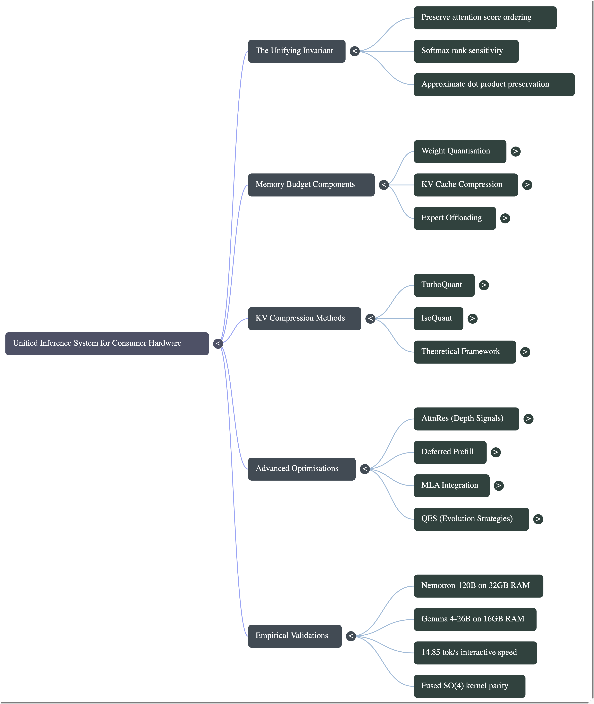
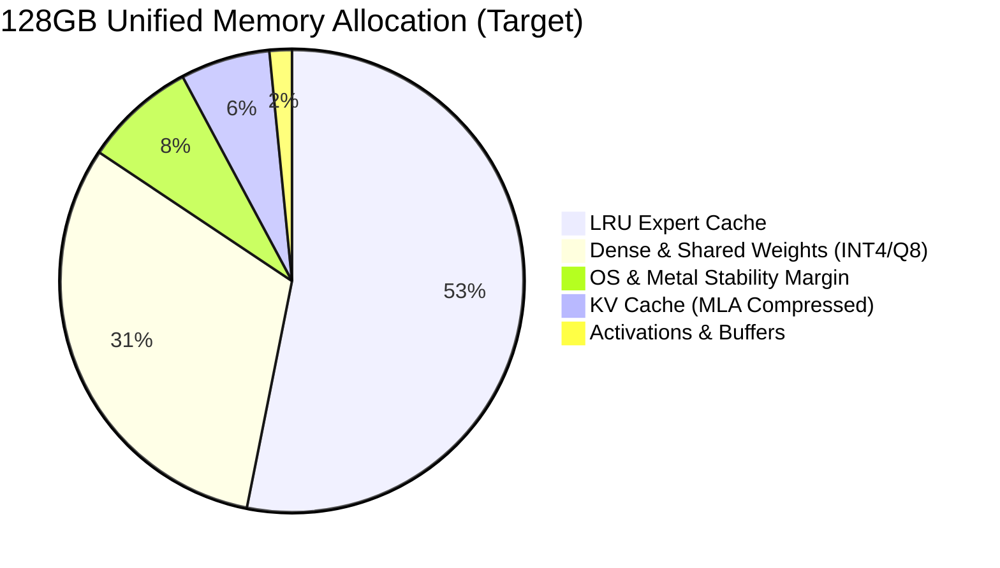
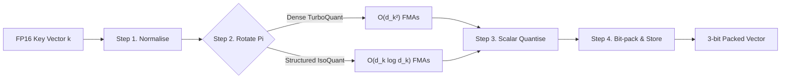
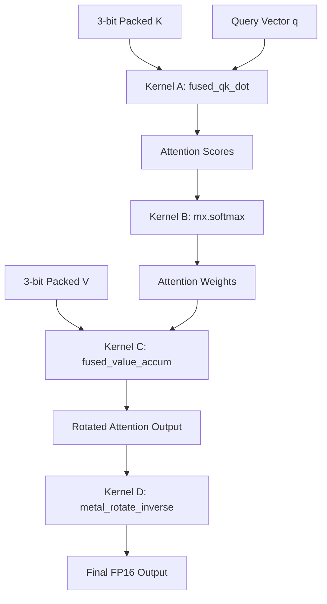
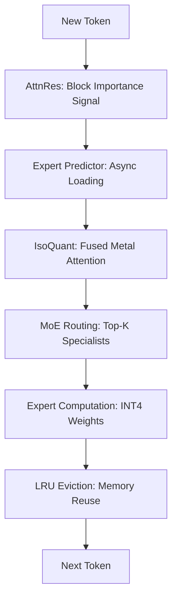

# Fused KV Cache Decode for Apple Silicon

**This repository implements a new execution model for attention: run attention directly on compressed KV cache -- no reconstruction, no GEMM (matrix multiply), fully fused Metal kernels, with parallel Mojo kernel prototypes for portability.**

**Podcast:** [Fitting a 120B Model on a MacBook — NotebookLM Breakdown](docs/Fitting_a_120B_model_on_a_MacBook.m4a) (download to listen)

**Video:** [TurboQuant vs IsoQuant](docs/TurboQuant_vs.mp4) (download to watch)

**Video:** [AI & the Yum Cha Kitchen](docs/AI_&_the_Yum_Cha_Kitchen.mp4) (download to watch)

> **Naming guide.** This repo is called **RotaryQuant** (the project). The core method is **IsoQuant** -- a fused KV cache compression pipeline using WHT (Walsh-Hadamard Transform, a fast structured mixing operation) + SO(4) (structured rotation across groups of 4 dimensions). **TurboQuant** (Frantar et al., ICLR 2026) is the baseline we compare against; it uses dense random rotations and reconstructs K/V tensors before attention. When you see "IsoQuant" in this README, that is the method you would run. When you see "TurboQuant", that is what we replace.


## TL;DR (Apple M4 Max)

- 120B model runs at **14.85 tok/s in 17.2 GB**
- KV cache compressed to **3-bit (5x smaller)**
- **No K/V reconstruction, no GEMM**
- **Fused Metal kernels (4 kernels total)**
- Near-zero quality loss (delta perplexity +0.001 — perplexity measures how well the model predicts text; lower is better)

| Method | KV Path | Gen (t/s) | Memory |
|--------|---------|-----------|--------|
| FP16 KV | Dequant + GEMM | ~100 | OOM at 120B |
| TurboQuant | Reconstruct + GEMM | 100.15 | High |
| **IsoQuant (this work)** | **Fused (no recon)** | **96.98** | **17.2 GB** |

---

Modern LLM inference during autoregressive decode is **memory-bandwidth bound**, not compute-bound. (Prefill and large-batch inference are compute-bound -- this work targets the single-user decode regime.) The dominant cost is not attention arithmetic itself, but reconstructing KV tensors before compute begins.

```
Standard execution model:
  compressed KV → dequantise → materialise FP16 tensors → GEMM → attention

IsoQuant execution model (this work):
  packed 3-bit KV → fused_qk_dot → softmax → fused_value_accum → inverse_rotate → output
  (no tensors materialised, no GEMM, data stays packed)
```

This repo implements that alternative pipeline:

- **Compute operates directly on compressed KV** -- no FP16 reconstruction
- **K/V tensors are never materialised** -- data stays in packed form
- **Attention executes in rotated space** -- inverse rotation applied once post-aggregation
- **Fused kernels replace GEMM** -- computation moves to the data, not vice versa
- **Structured rotation (WHT + SO(4))** replaces the expensive dense inverse rotation — cutting cost from quadratic (d²) to sub-linear (d log d) in head dimension
- **Mojo prototypes** explore this execution model beyond Metal

Result: **14.85 tok/s on a 120B-parameter model within 17.2 GB** on an M4 Max. Validated with 12/12 correctness and a 2-hour soak test.

### Core Claim

This is not a quantisation improvement. It is a shift in execution model: from *reconstruct-then-compute* to *compute-in-compressed-space*.

---

## What's Different

```
Standard KV decode:
  K/V cache → dequantise → full matmul → softmax → full matmul → output

This repo:
  packed 3-bit KV → fused_qk_dot → softmax → fused_value_accum → inverse_rotate → output
                     (no K/V materialised)
```

| Method | Rotation | K/V materialised? | Decode FMAs¹ | Stored params |
|--------|----------|-------------------|-------------|---------------|
| TurboQuant | Dense random | Yes (reconstruct) | O(d^2) | 16,384 |
| SpinQuant | Learned dense | Yes | O(d^2) | 16,384 |
| RotorQuant | Geometric algebra | No (claimed) | O(d log d) | ~256 |
| **IsoQuant (this work)** | **WHT + SO(4)** | **No (fused Metal)** | **O(d log d)** | **256** |

¹ FMAs = fused multiply-add operations, the basic arithmetic unit counted for GPU compute cost.

**TurboQuant** works today but pays quadratic (d²) decode cost and reconstructs tensors.
**RotorQuant** has better asymptotics but lacks production-grade fused kernels.
**IsoQuant** is the first systems-realised version: O(d log d) decode, fully fused Metal implementation, running on real models today.

---

## Key Insight

The bottleneck is not attention compute -- it is KV reconstruction.

Standard pipelines dequantise KV back to FP16, materialise full tensors, then run attention via GEMM. The reconstruction itself is the cost -- it saturates memory bandwidth before compute even begins.

This repo eliminates that step entirely. Attention runs directly on 3-bit packed data in registers. No tensors are materialised. No GEMM is called. Compute happens where data already is.

**This is a different execution model, not just a quantisation scheme.**

---

## The Fused Metal Pipeline

Four kernels, zero K/V reconstruction:

| Kernel | Operation | What it replaces |
|--------|-----------|------------------|
| **A: `fused_qk_dot`** | QK attention scores directly on 3-bit packed K | Dequant + matmul |
| **B: `mx.softmax`** | Standard softmax | (unchanged) |
| **C: `fused_value_accum`** | Weighted value sum on 3-bit packed V | Dequant + matmul |
| **D: `metal_rotate_inverse`** | WHT butterfly + SO(4) block inverse (1,408 multiply-adds) | Dense inverse (16,384 multiply-adds) |

These kernels are also prototyped in Mojo (`mojo-bench/`) to explore lower-level kernel optimisation and portability beyond Metal.

### The Real Bottleneck

> Kernel C (value accumulation) dominates runtime at **0.79 ms** -- more than Kernels A, B, and D combined.

This is not obvious. Most implementations assume QK matmul is dominant. In practice, with compressed KV, **value accumulation becomes the bottleneck** because each value must be decoded from 3-bit packed format and accumulated in a single pass.

We address this with a dual-strategy kernel:
- **Word-parallel** for short sequences (T < 512)
- **Dim-parallel** for long sequences (T >= 512)
- **Runtime auto-selection** via heuristic

### Verified on Apple M4 Max (Metal)

- Full GPU execution (no MLX fallback)
- Custom Metal kernels (no matmul / no gather)
- End-to-end correctness vs CPU reference: max error 3.8e-06

| Kernel | Description | Time (ms) |
|--------|------------|-----------|
| A | fused QK dot (3-bit decode) | 0.14--0.17 |
| B | softmax | 0.13--0.15 |
| C | fused value accumulation | **0.79 (dominant)** |
| D | WHT + SO(4) inverse | 0.11--0.14 |

---

## Why This Is Non-Trivial

This is not just quantisation:

- **3-bit values are bit-packed** -- must decode inside the kernel, not before it
- **No tensor materialisation** -- everything happens in registers
- **Rotation cannot be dense** -- replaced with WHT + SO(4) structured decomposition
- **GPU occupancy varies by regime** -- requires dual Kernel C strategies (short vs long sequence)

Even with emerging systems like Mojo, expressing these fused kernels requires careful control over memory layout, bit-packing, and warp-level execution -- this is not something standard matmul abstractions expose.

Most implementations avoid this by reconstructing tensors and calling GEMM. We explicitly avoid that.

---

## Why This Isn't Standard

Most systems do not fuse KV decode because:

1. **Bit-packed decode is hard to vectorise** -- 3-bit boundaries don't align with SIMD lanes
2. **Rotation breaks standard matmul assumptions** -- you can't call GEMM on rotated, packed data
3. **GPU kernels become occupancy-sensitive** -- different T regimes need different parallelism strategies
4. **Frameworks are built around GEMM abstractions** -- MLX, PyTorch, GGML all assume tensor materialisation

As a result, every existing system reconstructs tensors and calls GEMM.

IsoQuant instead moves compute into the decode path itself. The kernels decode, rotate, and accumulate in a single pass without ever materialising the full tensor.

---

## Architectural Constraints

### MLA / DKV Sub-Block Split (Hard Blocker for Kimi Path)

Models using Multi-Head Latent Attention (MLA), such as Kimi-K2.5, compress the KV representation architecturally. The MLA latent vector splits into two sub-spaces:

- **Content sub-space** (448 dims) -- learned semantic compression. IsoQuant may rotate and quantise this.
- **RoPE positional sub-space** (64 dims) -- positional phase encoding. **IsoQuant must never rotate or quantise this.**

Rotating RoPE dimensions smears positional phase into content coordinates, destroying long-context awareness. This is a non-negotiable architectural rule. The current implementation does not yet enforce this split -- it is a **hard blocker** for the Kimi-K2.5 pathway.

Additionally, if MLA already compresses KV sufficiently, IsoQuant becomes unnecessary. Decision gate: if additional compression < 10% over MLA alone or PPL increase > 0.5, skip IsoQuant entirely.

### AttnRes Predictor (Disabled -- Throughput Regression)

AttnRes is a cross-layer attention residual signal that predicts which experts will be needed next, enabling async prefetch. It is implemented (`--use-predictor`) but **disabled by default** due to a measured throughput regression:

- Gemma 4: **-11.2%** throughput
- Qwen3: **-10.6%** throughput
- Hit-rate improvement: **0%** (no benefit over baseline LRU)

**Root cause (suspected):** CPU/GPU command buffer contention -- the predictor signal computation competes with Metal kernel dispatch on the same command queue. Potential fixes include async offload to a CPU thread or deferred batch prediction, but neither has been validated.

**Current decision: No-go.** AttnRes remains in the codebase as an optional flag but is not part of the default stack.

**Path forward (two options, neither validated):**
1. **Async CPU offload** -- move predictor computation to a CPU thread pool, decouple from Metal command buffer. Risk: cross-device synchronisation overhead may negate the benefit.
2. **Retire AttnRes entirely** -- remove from the stack narrative, keep code as dead-path reference. This is the cleanest option if no one picks up the async offload work.

The decision is deferred until someone profiles the CPU/GPU contention boundary. If you have Metal profiling expertise, this is a high-value contribution.

### Deferred Prefill (Implemented)

During prefill (prompt processing), KV is stored in FP16 uncompressed. Compression happens **once** at the prefill-to-decode boundary, not per-token. This eliminates compounding quantisation error during the prompt phase.

```
Prefill phase (seq_len > 1):
  KV → accumulate in FP16 buffer → pass through uncompressed

Transition (first decode token):
  FP16 buffer → bulk compress via IsoQuant → 3-bit packed cache

Decode phase (seq_len = 1):
  new KV → incremental compress → append to packed cache
```

Implementation: `IsoQuantKVCache.finalize_deferred_prefill()` in `mlx-lm/mlx_lm/models/mlx_isoquant.py`. The FP16 buffer costs ~512 MB for 8K context — manageable on target hardware.

### DedeKimi Observer (Implemented)

Expert activation monitoring with entropy-based collapse detection. Tracks per-layer EMA of expert usage, reports Shannon entropy and collapse risk.

Implementation: `DedeKimiObserver` in `mlx-lm/mlx_lm/expert_offload.py`. Wired into `ExpertOffloadManager` for runtime monitoring. Tests in `tests/test_dedekimi_observer.py`.

Key methods: `record_activation()`, `get_layer_entropy()`, `expert_collapse_risk()`, `health_summary()`.

### End-to-End Profiling Gate (Open)

> **Gate:** If KV attention is < 20% of total decode time for a given model, IsoQuant's impact is negligible for that architecture.

This is an empirical question per model family. Current decode profiling shows:

| Architecture | KV attention share | IsoQuant impact |
|---|---|---|
| Standard MoE (Gemma4, Qwen3) | **51-54%** | High -- KV is the dominant cost |
| Hybrid Mamba+MoE (Nemotron-H) | **14%** | Low -- expert routing dominates |

**For any new model pathway, profile decode time breakdown first.** If KV attention is < 20%, IsoQuant is not the bottleneck and effort is better spent elsewhere. This gate should be the first step before attempting IsoQuant integration on a new architecture.

---

## Results

| Model | tok/s | Peak Memory | Budget | Quality | 2h Soak |
|-------|-------|-------------|--------|---------|---------|
| **Gemma 4-26B** | 12.85 | 5.4 GB | 16 GB | 12/12 | RSS 1.18x |
| **Nemotron-H 120B** | 14.85 | 17.2 GB | 32 GB | 12/12 | RSS 0.994x |
| **Qwen3.6-35B-A3B (mixed-precision)** | 15.6 | 6.8 GB cold / 12.0 GB warm | 16 GB | 12/12 | not yet run |

### Qwen3.6 mixed-precision pathway (April 2026)

The most recent pathway proof extends the three-axis stack to a new model family with a selective-precision recipe: 4-bit dense layers, 8-bit shared-expert and router-gate weights (the routing-fidelity anchor), 2-bit routed-expert weights, and IsoQuant 3-bit KV on the 10 of 40 full-attention layers (the remaining 30 are DeltaNet and use ArraysCache for their conv+SSM state). Compared to Q8_0 (37 GB resident, 11/12 quality) and uniform 4-bit MLX (19.6 GB resident, 11/12 quality, 117.8 tok/s), the mixed-precision configuration is the only one that fits the 16 GB target and is the only one that scores 12/12. The throughput cost (15.6 tok/s vs 117.8) is paid by expert offloading, not by the mixed-precision recipe itself.

Caveats: single-run quality, 2-hour soak not yet performed, KV fidelity not separately measured for this checkpoint. Full reproducibility detail (exact commands, commit hashes, artifact paths) in [docs/QWEN36_MIXED_PRECISION_RESULTS.md](docs/QWEN36_MIXED_PRECISION_RESULTS.md).

### KV Fidelity -- IsoQuant vs TurboQuant vs Baseline

| Model | IsoQuant delta PPL | TurboQuant delta PPL |
|-------|--------------------|----------------------|
| Qwen3-30B-A3B | **+0.0009** | +0.0405 |
| Gemma 4-26B | **+0.0000** | +0.0622 |
| Nemotron-H 120B | **+0.0012** | +0.0039 |

IsoQuant achieves quality parity with uncompressed KV. TurboQuant does not.

### llama.cpp Integration

IsoQuant is integrated as `GGML_TYPE_ISOQUANT3_0` with a fused Metal shader (`kernel_turbo_wht_so4`). The fused kernel eliminates 280 extra kernel launches:

| Configuration | Prompt (t/s) | Gen (t/s) |
|---|---|---|
| turbo3 (baseline) | 4114.6 | 100.15 |
| **isoquant3 fused** | **4093.8 (-0.5%)** | **96.98 (-3.2%)** |
| isoquant3 composed (unfused) | 2306.2 (-44%) | 81.92 (-18%) |

The fused kernel recovers near-baseline throughput. The unfused path shows why fusion matters: **44% prompt regression without it.**

All measurements on Apple M4 Max (128 GB, 40 GPU cores, macOS 15.4). Pinned artifacts under `results/`.

### When This Wins

- **Long context (T >= 2K)** -- bandwidth savings compound with sequence length
- **Memory-bound regimes** -- when KV cache size dominates available bandwidth
- **Large models on constrained hardware** -- 120B in 17 GB, 26B in 5.4 GB

### When It Does Not

- **Short sequences** -- dispatch overhead dominates at low T
- **Small batch sizes** -- kernel launch cost amortises poorly
- **Highly optimised GEMM backends** -- if your backend already saturates ALUs, bandwidth isn't the bottleneck

This is a bandwidth optimisation, not a universal speedup. It matters most when KV cache is the wall.

### Scaling Intuition

KV bandwidth scales linearly with sequence length (T). IsoQuant reduces bytes-per-token by ~5x and decode compute from quadratic to sub-quadratic. **Gains increase with T** -- this is why it matters at 2K--32K context, not at 128.

---

## Quick Start

```bash
git clone https://github.com/2096955/RotaryQuant.git
cd RotaryQuant
bash scripts/bootstrap.sh                   # installs everything in one step
python -m mlx_lm.server --model <model> --kv-cache-type isoquant --port 8000
```

Or manually:

```bash
pip install -e .                             # isoquant CLI wrapper
cd mlx-lm && pip install -e ".[test]" && cd ..  # MLX inference engine + test deps
```

### 5-Minute Smoke Test

**Requirements:** Apple Silicon Mac, Python 3.10+, ~2 GB free memory.

```bash
# Download a small model and run IsoQuant decode
python -m mlx_lm.generate \
  --model mlx-community/Qwen2.5-1.5B-Instruct-4bit \
  --prompt "Explain KV cache compression in one sentence." \
  --kv-cache-type isoquant \
  --max-tokens 50
```

**Expected:** coherent text output, no errors, ~20-40 tok/s on M-series chips. If this works, IsoQuant is correctly installed and running fused Metal kernels.

### Use with Claude Code

```bash
python -m mlx_lm.server --model <model> --kv-cache-type isoquant --port 8000 &
ANTHROPIC_BASE_URL=http://localhost:8000/v1 claude code
```

### Reproduce Benchmark

```bash
cd mlx-lm && pip install -e ".[test]"
python scripts/benchmark_fused_attention.py \
  --value-kernel auto \
  --bench-iters 100 \
  --json-out results.json
```

Expected output (M4 Max, H=8 T=2048 D=128):
```
fused_gpu_ms ≈ 0.9 ms
kernel_C    ≈ 0.8 ms  (dominant)
max_error   < 4e-06
```

---

## Repository Structure

| Directory | Contents |
|------------------|---------|
| `mlx-lm/` | MLX inference engine fork with IsoQuant KV cache + expert offload |
| `turboquant-mlx/` | KV compression library (codebooks, rotation matrices) |
| `mojo-bench/` | Mojo GPU kernel benchmarks (matmul, softmax, RoPE) |
| `scripts/` | Benchmark, comparison, validation, quality gate scripts |
| `results/` | Pinned benchmark artifacts and comparison outputs |
| `docs/` | Paper, benchmark spec, supporting documentation |
| `src/isoquant_mlx/` | CLI wrapper package (serve, validate, bench, convert) |

---

## Mojo Kernel Benchmarks (Research Artifact)

> **Status: research prototype only.** Mojo kernels are not used in the production inference path. They exist to study kernel behaviour and portability outside MLX/Metal. Do not depend on them for inference.

We include a parallel set of kernel implementations in Mojo (`mojo-bench/`) to study performance characteristics outside the MLX/Metal stack.

**Scope:** matmul baselines, softmax, RoPE / rotation kernels

**Purpose:**
- Validate kernel behaviour independent of MLX
- Explore portability to non-Metal backends
- Test lower-level optimisation strategies (tiling, memory layout, fusion)

---

## Roadmap

- [ ] llama.cpp full integration (`ggml-metal` backend, replace `ggml_compute_forward_flash_attn`)
- [ ] Single command-buffer fusion (remove remaining dispatch overhead)
- [ ] Kernel A+C fusion (eliminate intermediate score tensor)
- [ ] Larger context benchmarks (T >= 8K, T >= 32K)
- [ ] Mojo-native fused KV decode (portable backend beyond Metal)
- [ ] CUDA / Vulkan backend
- [ ] 1T-parameter validation on 128 GB hardware (Kimi-K2.5, 384 experts)

---

## Mind Map



---

# Full Technical Paper

**From Attention to Consumer Hardware: How MoE routing sparsity, isometric KV compression, and cross-layer attention signals compose into a unified inference system**

> *For the complete paper with all mathematical derivations, proofs, empirical results, and appendices, see [docs/FROM_ATTENTION_TO_CONSUMER_HARDWARE.md](docs/FROM_ATTENTION_TO_CONSUMER_HARDWARE.md).*

---

## The Unifying Invariant

The entire system is designed around one principle: **preserve the ordering of attention scores under constrained memory and bandwidth.** Softmax is invariant to additive shifts but highly sensitive to rank ordering — making top-k preservation more critical than minimising mean-squared error. Every component serves this invariant: KV compression preserves approximate dot products, isotropy-inducing rotations ensure error is spread uniformly, AttnRes identifies which computations matter, and MoE sparsity reduces the active parameter set.

---

## Standard Attention


Every transformer layer begins here. Each token is projected into three vectors — a **query** (Q), a **key** (K), and a **value** (V) — by multiplying its embedding by learned weight matrices.

Attention works by comparing the current query against every past key (a dot product), scaling the scores down by the square root of the head dimension (to keep them numerically stable), then normalising with softmax so the scores sum to 1. The output is the softmax-weighted sum of all past values — positions whose keys matched the current query closely contribute most.

**The memory problem is immediate.** During autoregressive generation, every past token's key and value vectors must be retained — that's the KV cache. For L layers, H attention heads, sequence length T, and head dimension d_k, at 2 bytes per FP16 value:

```
KV memory = 2 × L × H × T × d_k × 2 bytes
```

A 60-layer model with d_k = 128 at 8K context demands gigabytes of KV storage alone, and it grows linearly with every token generated.

---

## Mixture-of-Experts

A Mixture-of-Experts (MoE) layer replaces the single feed-forward network with E parallel expert networks. A learned gating network scores all E experts for the current token, picks the top-K by score, and routes the token only to those. The output is the weighted sum of their activations.

Only the top-K experts are active per token (typically K = 2 or K = 8). A model with E = 384 experts and K = 8 activates only ~2% of expert parameters per token — 1 trillion total parameters, but only ~3B active at any moment.

Some architectures include a **shared expert** that is always active regardless of routing, added on top of the top-K output. Its weights tend to capture common knowledge that every token needs.

---

## The Memory Budget Problem


```mermaid
pie title 128GB Unified Memory Allocation (Target)
    "LRU Expert Cache" : 68
    "Dense & Shared Weights (INT4/Q8)" : 40
    "OS & Metal Stability Margin" : 10
    "KV Cache (MLA Compressed)" : 8
    "Activations & Buffers" : 2
```

Three independent compression axes address three independent memory consumers:

**Weight quantisation** -- compress the model parameters (expert and dense weights). **KV cache compression** -- compress the attention state (keys and values stored per token). **Expert offloading** -- exploit routing sparsity to keep only active experts in RAM.

---

## KV Cache Compression Pipeline

Both TurboQuant and IsoQuant follow the same four-stage pipeline for compressing key vectors:


```mermaid
graph LR
    A[FP16 Key Vector k] --> B[Step 1. Normalise]
    B --> C{Step 2. Rotate Pi}
    C -- "Dense TurboQuant" --> D["O(d_k²) FMAs"]
    C -- "Structured IsoQuant" --> E["O(d_k log d_k) FMAs"]
    D --> F[Step 3. Scalar Quantise]
    E --> F
    F --> G[Step 4. Bit-pack & Store]
    G --> H[3-bit Packed Vector]
```

**Step 1. Normalise.** Scale each key vector to unit length (divide by its L2 norm). This removes magnitude variation and makes the distribution uniform on the unit sphere, which is what the rotation and codebook assume.

**Step 2. Rotate.** Apply a rotation that spreads correlated dimensions uniformly. IsoQuant uses WHT + SO(4) blocks; TurboQuant uses a dense random matrix. The rotation is isometric — it preserves distances and dot products, so the compressed representation stays faithful to the original.

**Step 3. Scalar quantise.** Each dimension is independently quantised using a Lloyd-Max codebook — a set of 2^b decision boundaries and centroids computed offline to minimise reconstruction error for the observed value distribution. At b = 3 bits, there are 8 possible centroid values per dimension. The key insight is that after rotation, values are approximately Gaussian and well-suited for this quantiser.

**Step 4. Bit-pack and store.** At 3-bit, 128 dimensions pack into 48 bytes — versus 256 bytes at FP16. A ~5x compression.

---

## IsoQuant: WHT + SO(4)

IsoQuant splits the head dimension into groups of 4 and rotates each group using a **quaternion sandwich** — a pair of quaternions (one left, one right) that together perform a full rotation in 4D space (SO(4)). This is structurally equivalent to a 4×4 orthogonal matrix but requires only 8 parameters instead of 16, and applies in O(1) per group.

The full pipeline: first a global Walsh-Hadamard Transform (a butterfly-style operation that mixes all dimensions in O(d log d)) to decorrelate globally, then the per-group SO(4) rotations to achieve local isotropy.

### Error Bound

The expected squared error on any attention dot product after 3-bit quantisation is bounded by a term that scales with the head dimension (d_k), the per-dimension quantisation noise (σ_q²), and the query norm. In practice this bound is tight — the measured delta-perplexity results bear it out.

Crucially, the rotation is **isometric** (distance-preserving): rotating both query and key by the same matrix leaves their dot product unchanged. This means the inverse rotation can be applied **once** on the aggregated attention output — after softmax and value accumulation — rather than once per cached token.

### Amortised Decode Cost

| Method | Decode read cost |
|--------|-----------------|
| **IsoQuant** | O(T × d_k) + O(d_k log d_k) |
| TurboQuant | O(T × d_k) + O(d_k²) |

T = sequence length; d_k = head dimension. TurboQuant's extra O(d_k²) term is the dense reconstruction matrix multiply — it grows quadratically with head size. IsoQuant replaces it with O(d_k log d_k) from the WHT butterfly. At d_k = 128: 16,384 operations vs 1,408.

### Fused Metal Decode Pipeline


```mermaid
graph TD
    K_packed[3-bit Packed K] --> KernelA[Kernel A: fused_qk_dot]
    Q[Query Vector q] --> KernelA
    KernelA --> Scores[Attention Scores]
    Scores --> KernelB[Kernel B: mx.softmax]
    KernelB --> Weights[Attention Weights]
    V_packed[3-bit Packed V] --> KernelC[Kernel C: fused_value_accum]
    Weights --> KernelC
    KernelC --> RotOut[Rotated Attention Output]
    RotOut --> KernelD[Kernel D: metal_rotate_inverse]
    KernelD --> FinalOut[Final FP16 Output]
```

Kernel D uses 1,408 FMAs (896 WHT butterfly + 512 SO(4) block matvecs) versus 16,384 for a dense inverse rotation.

| Property | TurboQuant | IsoQuant v3 (WHT + SO(4)) | Notes |
|---|---|---|---|
| Theoretical structured FMAs | 16,384 | 1,408 | Requires fused kernels |
| Actual write path FMAs | 16,384 | 16,384 | Both dense today |
| Decode read path | Dense reconstruct | Fused Metal pipeline | No K/V materialisation |
| Stored parameters | 16,384 | 256 | 64x fewer parameters |

### Inverse Rotation

IsoQuant's block-diagonal quaternion rotations are not self-cancelling — the inverse must be applied explicitly. Concretely: swap the left and right quaternions, conjugate both, and apply them in reverse order. Without this step, the output lives in the rotated coordinate space and is meaningless — perplexity explodes from 7.05 to 15,369.

---

## llama.cpp Integration

IsoQuant is integrated as `GGML_TYPE_ISOQUANT3_0` with dedicated Metal shaders. The fused `kernel_turbo_wht_so4` eliminates all dispatch overhead (280 extra kernel launches to 0):

| Configuration | Prompt (t/s) | Gen (t/s) | Source |
|---|---|---|---|
| turbo3 | 4114.6 | 100.15 | Pinned artifact |
| isoquant3 fused | 4093.8 (-0.5%) | 96.98 (-3.2%) | Pinned artifact |
| isoquant3 composed | 2306.2 (-44%) | 81.92 (-18%) | Pinned artifact |

---

## Empirical Results

### Pathway Proofs

| Model | Quality | tok/s | Peak Memory | Budget | 2h Soak | Status |
|-------|---------|-------|-------------|--------|---------|--------|
| **Gemma 4-26B** (layer-aware) | 12/12 | 12.85 `████░░░░░░` | 5.4 GB | 16 GB | P99/P50 1.29, RSS 1.18x | **Proven** |
| **Nemotron-H 120B** (mixed) | 12/12 | 14.85 `█████░░░░░` | 17.2 GB | 32 GB | P99/P50 1.14, RSS 0.994x | **Proven** |
| Nemotron-H 30B (mixed) | 10/12 | 35.5 `██████████` | 4.3 GB | 32 GB | P99/P50 1.16, RSS 1.03x | Blocked on quality |
| Qwen3-30B-A3B (4-bit) | 8/12 | 9.87 `███░░░░░░░` | 9.5 GB | 16 GB | -- | Blocked on quality |

### KV Fidelity (PPL at Fixed Depth)

| Model | backend | PPL @ 512 | PPL @ 2048 | Delta @ 2048 |
|---|---|---|---|---|
| **Qwen3-30B-A3B** | default | 1.3829 | 1.0844 | -- |
| | turboquant | 1.4497 | 1.1249 | +0.0405 |
| | isoquant | 1.3872 | 1.0853 | **+0.0009** |
| **Gemma 4-26B-A4B** | default | 3.2029 | 1.3483 | -- |
| | turboquant | 3.5180 | 1.4105 | +0.0622 |
| | isoquant | 3.2029 | 1.3483 | **+0.0000** |
| **Nemotron-H 120B** | default | 1.3911 | 1.0866 | -- |
| | turboquant | 1.4086 | 1.0905 | +0.0039 |
| | isoquant | 1.3961 | 1.0878 | **+0.0012** |

### Decode Profiling

| Component | Gemma4 (ms/tok) | Qwen3 (ms/tok) | Nemotron-H 120B (ms/tok) |
|---|---|---|---|
| kv_attention | 65.3 `█████░░░░░` (51%) | 58.1 `█████░░░░░` (54%) | 6.6 `█░░░░░░░░░` (14%) |
| routed_expert | 47.5 `████░░░░░░` (37%) | 48.3 `█████░░░░░` (45%) | 28.7 `██████░░░░` (60%) |
| dense_ffn | 11.5 `█░░░░░░░░░` (9%) | 0.0 `░░░░░░░░░░` (0%) | 0.0 `░░░░░░░░░░` (0%) |
| other (Mamba/SSM) | 0.0 `░░░░░░░░░░` (0%) | 0.0 `░░░░░░░░░░` (0%) | 11.3 `██░░░░░░░░` (24%) |
| uninstrumented | 3.9 `░░░░░░░░░░` (3%) | 1.3 `░░░░░░░░░░` (1%) | 1.5 `░░░░░░░░░░` (3%) |

KV attention is **51-54% of decode time** on standard MoE architectures (Gemma4, Qwen3), confirming it as the single largest cost center and justifying KV compression work. On hybrid Mamba+MoE (Nemotron-H), attention drops to 14% and expert routing dominates at 60%.

---

## The Full Stack


```mermaid
graph TD
    Token[New Token] --> AttnRes[AttnRes: Block Importance Signal]
    AttnRes --> Predictor[Expert Predictor: Async Loading]
    Predictor --> IsoQuant[IsoQuant: Fused Metal Attention]
    IsoQuant --> MoE[MoE Routing: Top-K Specialists]
    MoE --> FFN[Expert Computation: INT4 Weights]
    FFN --> Eviction[LRU Eviction: Memory Reuse]
    Eviction --> Output[Next Token]
```

**Core stack** (implemented, produces artefacts): Expert offloading with LRU and `ensure_loaded()`. IsoQuant (WHT + SO(4)) KV compression on Apple Silicon Metal. Fused 4-kernel Metal decode pipeline operating directly on 3-bit packed data. Inverse rotation moved after attention sum. Deferred prefill with bulk compression. Mixed-precision weight quantisation (4-bit dense, 2-bit experts, Q8_0 shared).

**Optional enhancements** (implemented, not enabled by default): AttnRes predictor (`--use-predictor`) -- throughput regression prevents it from being a net win on constrained hardware. Task-aware pinning -- 0% hit-rate improvement.

### Go/No-go Decisions (April 2026)

| Component | Decision | Rationale |
|---|---|---|
| IsoQuant (WHT + SO(4)) | **Go** | Quality parity with default (delta PPL ~ 0), 64x fewer parameters |
| Fused Metal pipeline (MLX) | **Go** | Verified by 9 correctness tests, eliminated materialisation |
| IsoQuant (llama.cpp) | **Active** | Fused kernel recovers near-turbo3 throughput |
| Deferred prefill | **Go** | Eliminates compounding error; ~512 MB buffer is manageable |
| Gemma4 pathway | **Go** | All gates pass at 12.85 tok/s within 16GB budget |
| Nemotron-120B pathway | **Go** | All gates pass at 14.85 tok/s within 32GB budget |
| Qwen3 pathway | **Blocked** | Quality issues (8/12) |
| AttnRes predictor | **No-go** | 10.6-11.2% throughput regression with no hit-rate improvement |
| Task-aware pinning | **No-go** | 0% hit-rate improvement over baseline LRU |
| QES | **Planned** | Background evolution strategies for gate-weight optimisation |

### Open Engineering Gaps

Honest inventory of what's proven vs what's still open. Items are ordered by impact.

| Gap | Status | Detail |
|-----|--------|--------|
| **Qwen3 pathway** | Blocked (8/12 quality) | IsoQuant KV + expert offload wiring is complete and runs end-to-end (9.87 tok/s, 9.5 GB peak). Quality gate fails 4 of 12 prompts. No 2-hour soak artifact. Must pass before claiming Qwen3 support. |
| **Gemma4 IsoQuant cache** | Documented, not wired | `gemma4_text.py:make_cache()` is hardcoded to `KVCache`/`RotatingKVCache` with no `kv_cache_type` parameter. Gemma3 has the wiring (`rotorquant` path for global-attention layers); Gemma4 does not. Sliding-window layers correctly use `RotatingKVCache` (compressing short-lived KV wastes compute). |
| **Shared expert offload policy** | Implicit, not explicit | `qwen3_next.py` shared experts are always-resident (sigmoid-gated, added to routed output). `expert_offload.py` has no key patterns, attachment logic, or LRU management for shared experts. Current behaviour is correct (shared experts should stay resident) but undocumented and untested under memory pressure. |
| **Head dimension coverage** | Partial | SO(4) blocks require `head_dim % 4 == 0` (enforced). WHT requires power-of-2 (graceful fallback to block-only rotation). Fused Metal kernel is hardcoded to `head_dim=128` (fallback to 3-kernel pipeline for others). Tested: 12, 128, 256. Not tested: 64, 96, 192. Numerical invariance harness is 128-only. |
| **QES (Quality Evolution Strategy)** | Designed, not implemented | Documented in BUILD_PHASES.md (Phase 7c) and the paper (Section 10.1.6) as "Planned." Zero code exists -- no reward functions, no perturbation loop, no simulation scripts. Blocked on Phase 5a gates + stable DedeKimi logs. |
| **Prefix caching** | Working, upstream PRs not tracked | Prefix cache trimming and LRU prompt cache are implemented in `mlx_turboquant.py` and `server.py`. A Qwen3 KV reconstruction bug (passing latest chunk instead of full reconstructed KV) was found and fixed. Upstream mlx-lm PRs #923/#980 are not referenced or tracked in this repo. |

---

## Gap Analysis: Proven vs Projected

| Dimension | Proven at 120B | Required for 1T | Gap |
|---------------------|----------------------------------------------|----------------------------------------------|--------------------------------------------------------------|
| Expert count | 512, topk=22 | 384, topk=8 | Different sparsity -- lower topk changes LRU dynamics |
| Working set | 7,544 of 20,480 shards | Unknown -- depends on routing entropy | Must characterise empirically |
| Memory budget | 17.2 GB of 25.6 GB target | ~110 GB of 128 GB target | Linear extrapolation holds if shard sizes scale |
| KV compression | Delta PPL +0.001 at 4K context | Same technique, longer context | Depth trend favourable but untested beyond 4K |
| Decode throughput | 14.85 tok/s | Target >5 tok/s (interactive) | Depends on expert load latency at 1T shard counts |
| Quality | 12/12 correctness harness | Must pass equivalent harness | Model-dependent, not stack-dependent |

---

## Symbol Reference

| Symbol | Math Role | Kitchen Equivalent |
|---|---|---|
| $Q$ | Query matrix | Current **customer order** (dough wrapper) |
| $K$ | Key matrix | **Labels/tags** on every prepped filling bowl |
| $V$ | Value matrix | The **actual fillings** themselves |
| $QK^\top$ | Attention score | Head chef **checking the match** (order vs label) |
| $\text{MoE}(x)$ | Expert mixture | **Calling the station chefs** for a dish |
| $G(x)$ | Gating function | **Floor Manager** deciding who works on the order |
| $D$ | Distortion | **Dumpling deformation** (squashed filling) |
| $c_i$ | Lloyd-Max centroids | **Steamer basket sizes** |
| $b_i$ | Decision boundaries | **Sorting rule** for portioning dumplings |
| $H_d$ | WHT rotation | **Global Mix** (rough stir in a massive bowl) |
| q_L, q_R | SO(4) quaternion rotation | **Two-Handed Fine Mix** (perfecting batches of 4) |
| $\Pi$ | Isometric rotation | **Portioning** (evening out the filling) |
| $\sigma_q^2$ | Quantisation error | **Crush factor** (lost filling due to thin paper) |
| $\alpha_{n \to l}$ | AttnRes block weights | **Mid-prep taste test** |

---

## References

[1] Zandieh, A., Daliri, M., Han, I., and co-authors.
*TurboQuant: Online Vector Quantization with Near-Optimal Distortion Rate.*
International Conference on Learning Representations (ICLR) 2026.
arXiv: [2504.19874](https://arxiv.org/abs/2504.19874).

[2] Zandieh, A., Daliri, M., Han, I.
*QJL: 1-Bit Quantized JL Transform for KV Cache Quantization with Zero Overhead.*
AAAI Conference on Artificial Intelligence (AAAI) 2025.
arXiv: [2406.03482](https://arxiv.org/abs/2406.03482).

[3] Liu, Z., Yuan, J., and co-authors.
*KIVI: A Tuning-Free Asymmetric 2bit Quantization for KV Cache.*
International Conference on Machine Learning (ICML) 2024.
arXiv: [2402.02750](https://arxiv.org/abs/2402.02750).
Code: https://github.com/jy-yuan/KIVI.

[4] Zhang, H., Liu, J., and co-authors.
*KVQuant: Towards 10 Million Context Length LLM Inference with KV Cache Quantization.*
Conference on Neural Information Processing Systems (NeurIPS) 2024.
arXiv: [2401.18079](https://arxiv.org/abs/2401.18079).

[5] Kang, H., Li, Y., and co-authors.
*GEAR: An Efficient KV Cache Compression Recipe for Near-Lossless LLM Inference.*
arXiv preprint, 2024.
arXiv: [2403.05527](https://arxiv.org/abs/2403.05527).

[6] RotorQuant / IsoQuant authors.
*RotorQuant / IsoQuant: Rotated Quantization Methods for KV Cache Compression.*
arXiv: [2603.28430](https://arxiv.org/abs/2603.28430).
(Include the final canonical title, full author list, and upstream implementation URL once finalized.)

[7] Ashkboos, C., Mohtashami, S., and co-authors.
*QuaRot: Outlier-Free 4-Bit Inference in Rotated LLMs.*
Conference on Neural Information Processing Systems (NeurIPS) 2024.
arXiv: [2404.00456](https://arxiv.org/abs/2404.00456).

[8] Chmiel, B., Gale, T., and co-authors.
*QuIP#: Even Better LLM Quantization with Hadamard Incoherence and Lattice Codebooks.*
International Conference on Machine Learning (ICML) 2024.
arXiv: [2402.04396](https://arxiv.org/abs/2402.04396).

[9] Eliseev, D., Mazur, M.
*Fast Inference of Mixture-of-Experts Language Models with Offloading.*
arXiv preprint, 2023.
arXiv: [2312.17238](https://arxiv.org/abs/2312.17238).

[10] mudler and contributors.
*APEX-Quant: Layer-Aware Expert Quantization for Mixture-of-Experts Models.*
GitHub repository, 2024.
Code: https://github.com/mudler/apex-quant.

[11] Zhang, Z., Yang, Y., and co-authors.
*MxMoE: Mixed-Precision Quantization for MoE with Accuracy and Efficiency.*
International Conference on Machine Learning (ICML) 2025.
arXiv: [2505.05799](https://arxiv.org/abs/2505.05799).

[12] Chitty-Venkata, A., Patel, V., and co-authors.
*MoPEQ: Mixture of Mixed Precision Quantized Experts.*
ICCV 2025, BiVision Workshop.
arXiv: [2509.02512](https://arxiv.org/abs/2509.02512).

[13] Chen, Y., Narayanan, P., and co-authors.
*Dynamic Expert Quantization for Scalable Mixture-of-Experts Inference (DynaExQ).*
arXiv preprint, 2025.
arXiv: [2511.15015](https://arxiv.org/abs/2511.15015).

[14] Moonshot AI / Kimi Team.
*AttnRes: Block-Attention Residual for Cross-Layer Attention Signals.*
arXiv preprint, 2026.
arXiv: [2603.15031](https://arxiv.org/abs/2603.15031).

[15] MLX Team.
*MLX: Numerical Computing Framework for Apple Silicon.*
GitHub repository.
https://github.com/ml-explore/mlx.

[16] MLX Team.
*mlx-lm: Large Language Model Utilities for MLX.*
GitHub repository.
https://github.com/ml-explore/mlx-examples/tree/main/llms/mlx_lm.

[17] Gerganov, G., and contributors.
*llama.cpp: Inference of LLaMA Models in C/C++.*
GitHub repository.
https://github.com/ggml-org/llama.cpp.

[18] TurboQuantNemo Authors.
*TurboQuantNemo: MLX / Nemotron Integration with TurboQuant-Style KV Cache Compression.*
GitHub repository.
https://github.com/2096955/TurboQuantNemo.

[19] tonbistudio.
*turboquant-pytorch: PyTorch Reference Implementation of TurboQuant.*
GitHub repository.
https://github.com/tonbistudio/turboquant-pytorch.

[20] Lloyd, S.
*Least Squares Quantization in PCM.*
IEEE Transactions on Information Theory, 28(2):129–137, 1982.
https://ieeexplore.ieee.org/document/1056489.

[21] Johnson, W. B., Lindenstrauss, J.
*Extensions of Lipschitz Mappings into a Hilbert Space.*
Contemporary Mathematics, 26:189–206, 1984.

For the complete reference list, see the [full paper](docs/FROM_ATTENTION_TO_CONSUMER_HARDWARE.md#12-references-and-attribution).

---

## Deployment & Stability

This is a research checkpoint, not a production release. Key risk gates for production readiness:

| Gate | Current Status | Target |
|------|---------------|--------|
| Memory ceiling | 17.2 GB peak (120B) | Must not exceed hardware budget under any input |
| P99 latency | P99/P50 ratio 1.14 (120B) | < 2.0x for interactive use |
| RSS non-growth | 0.994x over 2h soak | Must not grow over 24h (not yet tested) |
| Long-context fidelity | Validated at 2K tokens | Must validate at 8K, 16K, 32K |
| MLA/DKV split | Not implemented | Hard blocker for Kimi-K2.5 path |
| MLX lazy eval fencing | Undocumented | `mx.eval()` fencing strategy needed for sustained load |

**Known risks:** MLX lazy evaluation and buffer pooling interact with fused Metal kernels in ways that are currently undocumented. Silent OOM or memory fragmentation under sustained load is possible. The 2-hour soak test passed, but a 24-hour soak has not been run.

---

## Running Tests & Contributing

```bash
# Run the full test suite
cd mlx-lm && pytest tests/ -v

# Run the quality gate (12-prompt correctness harness)
python scripts/eval_quality_gate.py --model <model> --kv-cache-type isoquant

# Run kernel precision validation
python scripts/validate_kernel_precision.py

# Run a 2-hour soak test
python scripts/run_2h_soak.py --model <model>
```

**What a PR must include:**
- Quality gate pass (12/12) for any affected model pathway
- Kernel precision validation pass (max error < 1e-05)
- No RSS growth over baseline in a soak test
- Pinned result JSON in `results/` for any new benchmark claims

See [CONTRIBUTING.md](CONTRIBUTING.md) for full guidelines and [CHANGELOG.md](CHANGELOG.md) for version history.

---

## Benchmarking Gaps (Help Wanted)

These require hardware time and are the highest-impact contributions:

- [ ] **PPL validation across context lengths** -- run PPL curves at 512, 2K, 4K, 8K tokens compared against FP16 baseline. All current results are <= 2K. This is the single most important credibility gap.
- [ ] **24-hour soak test** -- extend `scripts/run_stability_soak.py` to 24h with `vm_stat` + RSS monitoring, enforce P99 < 3x P50, RSS non-growth, 110 GB ceiling. Current 2h soak is insufficient.
- [ ] **Long-context benchmarks** -- run and publish IsoQuant decode performance at 8K, 16K, 32K tokens
- [ ] **MoE ablation benchmarks** -- baseline TurboQuantNemo vs fused IsoQuant vs hybrid (fused KV + MoE offloading)
- [ ] **Numerical invariance on MLA content latents** -- extend `scripts/validate_numerical_invariance.py` to test on real Kimi-K2.5 content sub-space (448-dim) latents, not just synthetic data
- [ ] **End-to-end profiling gate** -- run decode profiling on candidate architectures before IsoQuant integration (gate: KV attention must be >= 20% of decode time)

---

## If You Only Remember One Thing

LLM decode is not compute-bound. It is **memory-bandwidth bound**.

Most systems: reconstruct KV, then run GEMM.

IsoQuant: runs attention directly on compressed KV.

That's the difference.

---

## Contributing

Contributions, bug reports, and peer review are welcome. See [CONTRIBUTING.md](CONTRIBUTING.md) for guidelines.

---

## License

Apache 2.0. See [LICENSE](LICENSE).
