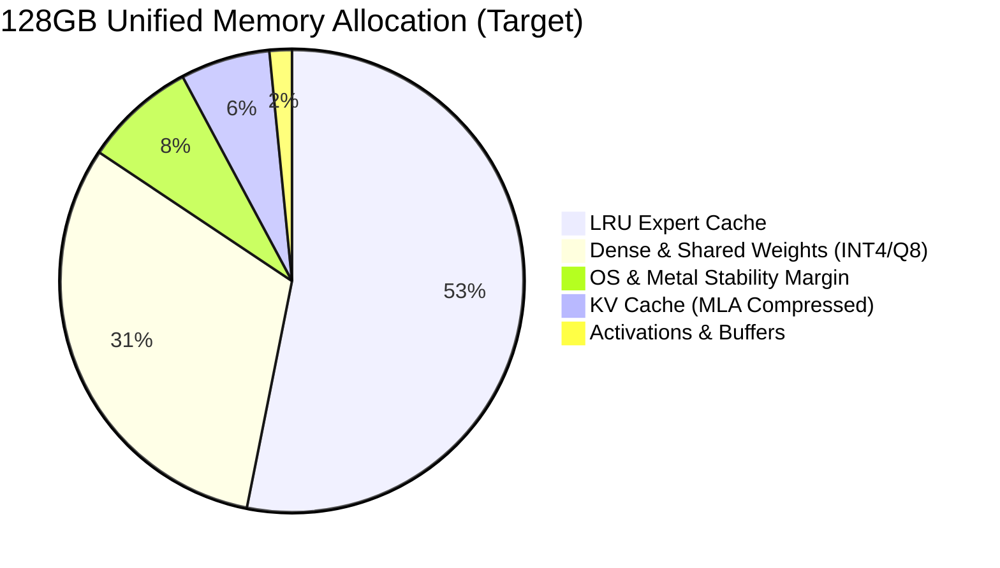
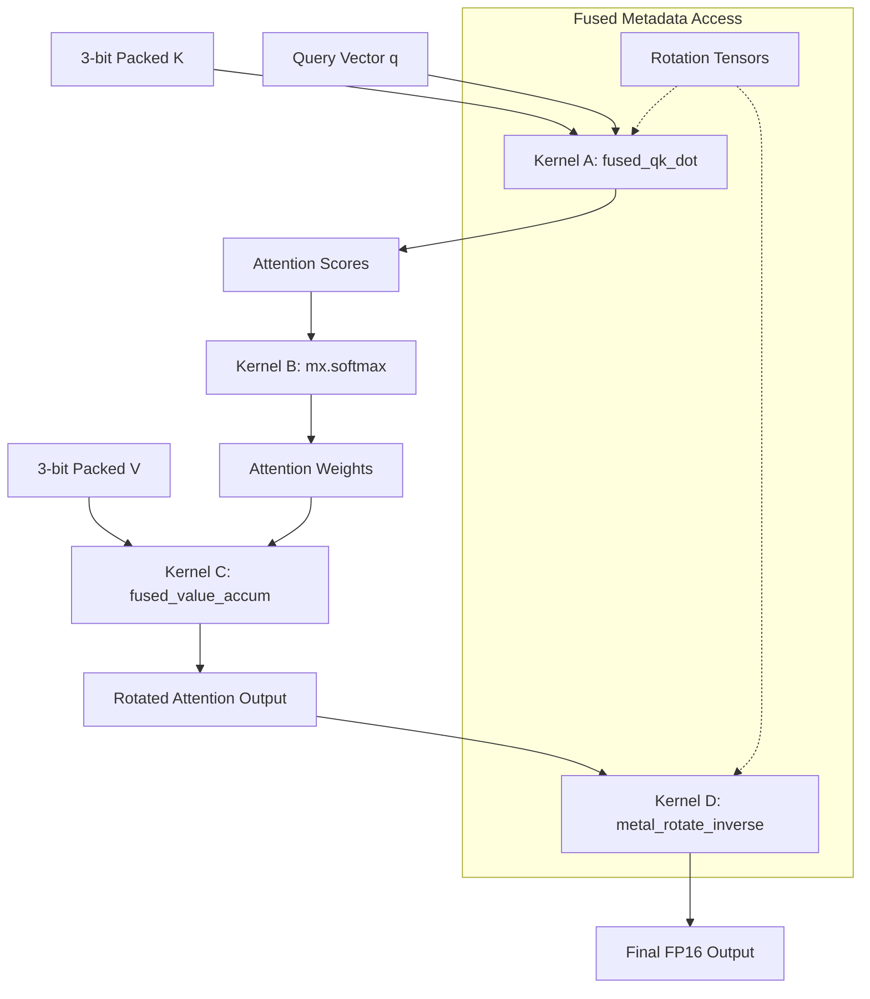
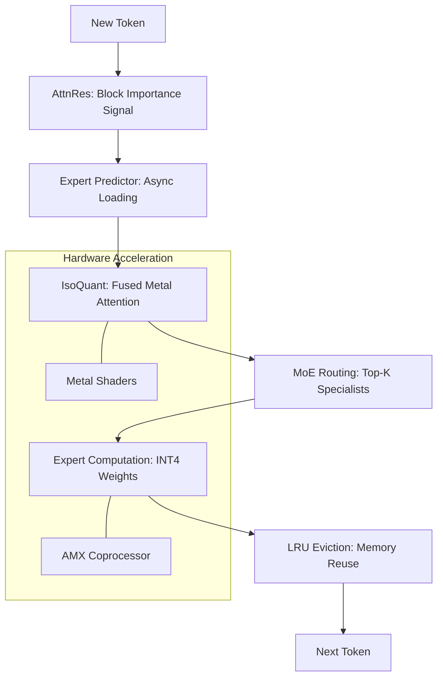

# From attention to consumer hardware

**How MoE routing sparsity, isometric KV compression, and cross-layer attention signals compose into a unified inference system**

---

> **How to read this document.** Each section opens with the maths, then a grey box like this one explains the intuition. All the analogies use a single running metaphor: *a yum cha kitchen preparing 384 dim sum dishes from a tiny service area*. The AI model is the kitchen. The specialist experts are station chefs. Incoming tokens are customer orders. RAM is counter and steamer-basket space. Disk is the back alley where the off-duty chefs wait. The star dish — siu loong bao (soup dumplings) — stands in for the most demanding operation: KV cache compression. If you're comfortable with the equations, skip the grey boxes. If you want the intuition first, read only the grey boxes for a complete story, then come back to the maths.

---

## 0. The Unifying Invariant

The entire system is designed around one principle: **preserve the ordering of attention scores under constrained memory and bandwidth.** Softmax is invariant to additive shifts but highly sensitive to rank ordering — making top-$k$ preservation more critical than mean-squared error (MSE). Every component serves this invariant: KV compression preserves approximate dot products, isotropy-inducing rotations ensure error stability, AttnRes identifies which computations matter, and MoE sparsity reduces the active parameter set.

1. Standard attention
2. Mixture-of-experts
3. The memory budget problem
4. KV cache compression
4.1 Comparison with existing methods
4.2 Approximate isotropy
5. TurboQuant — dense global rotation
5.1 QJL residual correction
6. IsoQuant — isometric rotation via WHT + SO(4)
6.1 The SO(4) rotation
6.2 The v1->v2->v3 evolution
6.3 Current runtime reality
6.4 WHT is required
6.4b llama.cpp integration
6.5 Inverse rotation
7. Deferred prefill
8. MLA
9. Attention residuals (AttnRes)
10. The full stack
10.1 Empirical results
11. Scaling gap analysis: 120B → 1T
12. References and Attribution
Appendix A: Symbol-to-kitchen mapping
Appendix B: AttnRes mathematical formulation


---


**Status (April 2026).** This paper describes an approach to running trillion-parameter MoE models on consumer Apple Silicon. The core stack is validated at 120B parameters (Nemotron-H: 14.85 tok/s, 12/12 quality, 2h soak within 32GB budget) and 26B parameters (Gemma 4: 12.85 tok/s, 12/12 quality within 16GB budget). Extension to 1T-class models (e.g., Kimi-K2.5 with 384 experts on 128GB hardware) is projected from the memory budget analysis in Section 10 but not yet empirically validated. This work is under active development and peer review. Measured results are reported in Section 10.

**Repository and framework credits.** The validated MLX pathway described here is implemented in [TurboQuantNemo](https://github.com/2096955/TurboQuantNemo) [18], built on [MLX](https://github.com/ml-explore/mlx) [15] and an [mlx-lm](https://github.com/ml-explore/mlx-examples/tree/main/llms/mlx_lm) [16] fork, with a parallel [llama.cpp](https://github.com/ggml-org/llama.cpp) [17] track for GGML/Metal validation. TurboQuant comparisons refer to the KV-cache method from Frantar et al. [1] and its reference implementations rather than claiming that all MoE offload work in this repository is itself "TurboQuant."

---

## 1. Standard attention — the starting point

> **The main prep area.** Every time a new order comes in, the head chef must check the main prep area — the containers of prepped fillings already on the counter. How was the pork-and-ginger mix from table 4? Is the prawn paste from the first batch of har gow still fresh? That check across every prepped container is *attention*. The full set of prep containers is the *KV cache*. As the day goes on, the counter fills up with bowls. Our problem: we're running out of counter space.

Every transformer layer begins here. Given a sequence of token embeddings, we project into queries, keys, and values:

$$Q = XW_Q, \quad K = XW_K, \quad V = XW_V$$

where $X \in \mathbb{R}^{T \times d_{\text{model}}}$ and each projection $W \in \mathbb{R}^{d_{\text{model}} \times d_k}$. The attention output is:

$$\text{Attention}(Q, K, V) = \text{softmax}\!\left(\frac{QK^\top}{\sqrt{d_k}}\right) V$$

The softmax operates row-wise. For query position $i$, the attention weights over all key positions $j = 1, \ldots, T$ are:

$$a_{ij} = \frac{\exp(q_i^\top k_j / \sqrt{d_k})}{\sum_{m=1}^{T} \exp(q_i^\top k_m / \sqrt{d_k})}$$

The output for position $i$ is the weighted sum $o_i = \sum_j a_{ij} \, v_j$.

**The memory problem is immediate.** During autoregressive generation, every past token's key and value vectors must be retained — the *KV cache*. For $L$ layers, $H$ heads, sequence length $T$, and head dimension $d_k$:

$$\text{KV memory} = 2 \times L \times H \times T \times d_k \times \text{bytes per element}$$

At FP16 (2 bytes), a 60-layer model with $d_k = 128$ and 8K context already demands gigabytes of KV storage alone.

---

## 2. Mixture-of-experts — the parameter explosion

> **The station chefs.** Your kitchen has 384 specialised station chefs, but any given order only needs 8. The shared expert is the kitchen si fu — the master chef who inspects, adjusts, and signs off on every single dish before it leaves the pass. Because the si fu's hands touch everything, they get the best equipment and prime counter space (Q8_0 precision). The other 376 specialists are idle most of the time. We keep the 8 active ones at their stations and send the rest outside — they're out the back playing cards, but the floor manager (the router) can yell their name and have them back at their station in seconds.

In a standard transformer, each layer's feed-forward network (FFN) is:

$$\text{FFN}(x) = W_2 \, \sigma(W_1 x)$$

where $W_1 \in \mathbb{R}^{d_{\text{ff}} \times d}$, $W_2 \in \mathbb{R}^{d \times d_{\text{ff}}}$, and $\sigma$ is typically SiLU/GELU.

A Mixture-of-Experts layer replaces this single FFN with $E$ parallel expert networks $\{f_1, \ldots, f_E\}$ and a gating (routing) function $G$:

$$G(x) = \text{softmax}(W_g \, x) \in \mathbb{R}^E$$

$$\text{MoE}(x) = \sum_{e \in \text{TopK}(G(x))} G(x)_e \cdot f_e(x)$$

Only the top-$K$ experts (typically $K = 2$ or $K = 8$) are activated per token. This is the critical sparsity property: a model with $E = 384$ experts and $K = 8$ activates only ~2% of expert parameters per token. The model has 1 trillion total parameters, but only ~3B are active at any moment. The remaining 97% are dead weight in RAM — *unless we can offload them*.

### 2.1 Shared experts

Some architectures (Kimi-K2.5, DeepSeek) include a *shared expert* $f_{\text{shared}}$ that is always active regardless of routing:

$$\text{MoE}(x) = f_{\text{shared}}(x) + \sum_{e \in \text{TopK}(G(x))} G(x)_e \cdot f_e(x)$$

The shared expert carries the "common knowledge" load. Empirically, its weight distributions are extremely heavy-tailed: shared expert **excess kurtosis** measures 10.10 versus 0.41 for routed experts — a **24.6× gap** (relative to a Gaussian baseline of 0). This suggests the shared expert's weight distribution has far more outlier values that aggressive quantisation would destroy. We pin it at Q8_0 — a decision grounded in this kurtosis heuristic. A rigorous structural proof requires a loss sensitivity analysis (e.g., via the Hessian, as in MoPEQ [12]) to confirm these outliers directly impact downstream performance; until then, it remains an empirically-driven policy.

---

## 3. The memory budget problem

For a 1T-parameter MoE on a 128GB machine:

| Component | Uncompressed | Target |
|---|---|---|
| All expert weights | ~800 GB | Can't be resident |
| Dense/shared weights | ~40 GB | ~10 GB (4-bit) |
| KV cache (8K context) | ~8 GB | ~1–2 GB (3-bit) |
| Activations + overhead | ~5 GB | ~5 GB |


<!-- DESIGNER NOTE: Create a comparative infographic showing a massive 800GB block (Uncompressed MoE) shrinking into a 128GB container using these three axes. -->

Three independent compression axes address three independent memory consumers:

**Weight quantisation** — compress the model parameters (expert and dense weights). **KV cache compression** — compress the attention state (keys and values stored per token). **Expert offloading** — exploit routing sparsity to keep only active experts in RAM.

> **Note:** These axes are implemented independently. Weight quantisation operates on $W$ matrices. KV compression operates on the $k_j, v_j$ vectors stored during generation. Expert offloading operates on the residency policy — which weights are in RAM vs. on disk. They interact through model dynamics (e.g., quantised weights produce slightly different KV vectors), but each can be enabled, disabled, or tuned without modifying the others.

> **Three ways to fit 384 dishes into a tiny kitchen.** (1) *Shrink the recipe cards* — write shorthand the chefs can still follow, like "B3" instead of a full-page recipe (weight quantisation). (2) *Stack the fillings in small tubs in the fridge* — instead of 128 open bowls covering the entire counter, portion each filling into a small labelled tub and stack them in the walk-in. When the chef needs one, they pull the tub and reconstitute (KV cache compression). (3) *Send most chefs outside* — only the 8 active ones stay at their stations. The other 376 are out the back playing cards or smoking, but they can hear the floor manager yell their name and be back at their station in seconds (expert offloading). These three don't conflict. Each targets a different space problem: recipe storage, counter space, and how many bodies are in the kitchen.

---

## Related Work

**KV cache compression:** Methods like KIVI [3] (2-bit per-channel key/per-token value) and KVQuant [4] (2-bit non-uniform with sensitivity weights) target high-precision outlier handling. Gear [5] uses low-rank decomposition plus sparse residuals. TurboQuant [1] (3-bit dense global rotation) promotes isotropy globally. Our IsoQuant approach builds on these by using structured WHT + SO(4) rotations, requiring 64x fewer parameters than TurboQuant while achieving comparable approximate isotropy [6].

**Expert offloading:** Offloading experts to NVMe builds on foundational work by Eliseev & Mazur [9], MxMoE [11], and APEX [10].

**Consumer-hardware inference:** This work sits within the ecosystem of local inference engines like [llama.cpp](https://github.com/ggml-org/llama.cpp) [17], [MLX](https://github.com/ml-explore/mlx) [15], and Ollama, specifically pushing the boundary of what fits in 16GB-32GB unified memory.

**Structured rotations:** The use of structured matrices for quantization builds on the QuaRot line of work [7], QuIP# [8], and RotorQuant / IsoQuant [6].

| System | Nemotron-120B on 32GB M4 | KV Compression | Expert Offload |
|--------|--------------------------|----------------|----------------|
| Stock mlx-lm | Does not fit (120B requires >32GB even at 4-bit) | None | None |
| llama.cpp (GGUF Q4) | Does not fit without splitting | None | Manual shard splitting |
| This work | 14.85 tok/s, 17.2 GB peak | IsoQuant 3-bit | LRU, zero evictions at 11.4K slots |

The key defence of this system is that models like Nemotron-120B simply do not fit in 32GB without the three-axis composition of weight quantization, KV compression, and expert offloading. That is the primary contribution.

## 4. KV cache compression — the shared pipeline

Both TurboQuant and IsoQuant follow the same four-stage pipeline for compressing key vectors. We describe it generically, then show where they diverge.

```mermaid
graph LR
    A[FP16 Key Vector k] --> B[Step 1. Normalise]
    B --> C{Step 2. Rotate Pi}
    C -- "Dense (TurboQuant)" --> D[O(d_k^2) FMAs]
    C -- "Structured (IsoQuant)" --> E[O(d_k log d_k) FMAs]
    D --> F[Step 3. Scalar Quantise]
    E --> F
    F --> G[Step 4. Bit-pack & Store]
    G --> H[3-bit Packed Vector]
```

Given a key vector $k \in \mathbb{R}^{d_k}$ (one head, one token):

**Step 1. Normalise.** Map to the unit sphere: $\hat{k} = k / \|k\|_2$. Store $\|k\|$ separately (1 scalar per vector). In yum cha terms: weigh each filling and express it as a proportion of the total batch. Record the original weight on the wrapper's label so you can scale back later.

**Step 2. Rotate** (the divergence point). Apply an isometric transformation $\Pi$ to spread correlated dimensions uniformly: $\tilde{k} = \Pi(\hat{k})$. The rotation must preserve inner products: $\langle \Pi(a), \Pi(b) \rangle = \langle a, b \rangle$. This is essential — the attention score $q^\top k$ must survive the round-trip through compression. Think of this as portioning the filling so every dumpling gets the same amount before wrapping. If some dumplings are overstuffed and others are empty, the standard wrapper won't fit properly. "Isometric" means no filling is lost or created — you're just redistributing between dumplings until they're all equal. "Orthogonal" means it's perfectly reversible — you can always scoop the filling back out and recover the original portions exactly.

**Step 3. Scalar quantise.** Each dimension of $\tilde{k}$ is independently quantised using Lloyd-Max optimal codebooks [20]. Lloyd-Max is a dual-optimisation: you simultaneously find the best *decision boundaries* $b_i$ (where to split the range) and *reconstruction centroids* $c_i$ (what value to store for each bin). The objective is to minimise the total distortion:

$$D = \sum_{i=1}^{2^b} \int_{b_{i-1}}^{b_i} (x - c_i)^2 \, p(x) \, dx$$

where $p(x)$ is the probability density of the rotated vector components and $b$ is the bit-width. This is solved by two interlocking conditions:

**Nearest-neighbour condition (optimal boundaries).** For fixed centroids, boundaries sit exactly halfway between adjacent centroids:

$$b_i = \frac{c_i + c_{i+1}}{2}$$

**Centroid condition (optimal reconstruction values).** For fixed boundaries, each centroid is the conditional mean — the centre of mass of the distribution within its bin:

$$c_i = \frac{\int_{b_{i-1}}^{b_i} x \, p(x) \, dx}{\int_{b_{i-1}}^{b_i} p(x) \, dx}$$

Because these depend on each other, they're solved iteratively (Lloyd's algorithm): initialise centroids, update boundaries, update centroids, repeat until distortion converges.

Why does this matter for a 1T model? LLM activations aren't uniformly distributed — they're peaky near zero with long tails. Uniform quantisation (like rounding to the nearest 0.1) wastes most of its bins on the empty tails and under-resolves the dense centre. Lloyd-Max puts more centroids where the data actually lives — high-density regions get more bins and higher precision, low-density tails share fewer bins.

In yum cha terms: you have 8 different-sized steamer baskets (the centroids) for packing 128 dumplings. Uniform basket sizes mean most baskets are too big for the common small dumplings and too small for the occasional large one — wasted space everywhere. Lloyd-Max sizes the baskets to match how your dumplings are actually distributed: lots of small baskets for the common portions, a few large ones for the outliers. The rotation in Step 2 ensures the dumplings are portioned evenly enough for this basket-sizing to work optimally. Now that every dumpling is the same size, place each one into the best-fitting basket and stamp it with a code — "P3" instead of "pork-ginger-scallion-gelatin 12g."

**Step 4. Bit-pack and store.** Quantised indices are packed into integers. At 3-bit, 128 dimensions pack into 48 bytes — versus 256 bytes at FP16. A ~5× compression. Uniform dumplings stack tightly in the steamer basket.

### Score estimation at decode time

When computing attention, the query $q$ remains at full precision. The compressed key must be decompressed to estimate $q^\top k$:

$$\widehat{q^\top k} = \|k\| \cdot q^\top \Pi^{-1}(Q_b(\Pi(\hat{k})))$$

The estimation error is:

$$\epsilon = q^\top k - \widehat{q^\top k} = \|k\| \cdot q^\top \Pi^{-1}(\Pi(\hat{k}) - Q_b(\Pi(\hat{k})))$$

This is the quantisation residual, projected back through the inverse rotation. Softmax is invariant to additive shifts but highly sensitive to rank ordering — making top-$k$ preservation more critical than MSE.

> **Wrapping and stacking the siu loong bao.** You need to fit 128 prepped dumplings into a tiny fridge. The four steps: (1) *Weigh* each dumpling and note the weight (normalise). (2) *Even out the portions* — if some dumplings are overstuffed and others are nearly empty, a standard wrapper won't fit them all. So you redistribute: scoop filling from the fat ones into the skinny ones until every dumpling is the same size (rotate). (3) *Wrap* — now that they're all uniform, fold each one into a standard skin with a stamped code (quantise). (4) *Stack in the steamer* — uniform dumplings stack tightly (bit-pack). When the chef needs one, they unwrap and reconstitute. The question TurboQuant and IsoQuant disagree on: how do you do step 2 — the evening-out?

### 4.1 Comparison with existing methods

Our rotation-based pipeline (IsoQuant/TurboQuant) addresses the same KV memory bottleneck as existing techniques but differs in its strategy for handling activation outliers. Direct comparison on identical benchmarks is left to future work; our comparison focuses on TurboQuant as the closest methodological relative (same quantization pipeline, different rotation strategy).

| Method | Bits | Strategy | Core Advantage |
|---|---|---|---|
| **KIVI** | 2-bit | Per-channel key / Per-token value | Captures static outlier channels |
| **KVQuant** | 2-bit | Non-uniform quantisation | Per-channel sensitivity weights |
| **Gear** | Mixed | Low-rank + Sparse residual | Captures high-magnitude residuals |
| **TurboQuant** | 3-bit | Dense random orthogonal rotation | Promotes isotropy globally |
| **IsoQuant** | 3-bit | WHT + SO(4) structured rotation | **64× fewer parameters** than TQ |

In contrast, our approach uses **isometric rotation** to eliminate outlier channels before they reach the quantiser. By promoting isotropy, we distribute the informational "load" evenly across all dimensions, making uniform-precision scalar quantisation effective without requiring per-channel logic or complex residuals.

---

### 4.2 Approximate isotropy — why aggressive scalar quantisation works

The pipeline above compresses 128-dimensional vectors to 3 bits per dimension — a 5× reduction. Why doesn't this destroy the model's ability to attend to the right tokens? The answer lies in the interaction between the isometric rotation and Lloyd-Max scalar quantisation.

### Formal definitions

**Isometry error $\delta$**: We define the isometry error of a rotation matrix $\Pi$ as the maximum deviation from identity in its self-inner-product: $\delta = \max_{i,j} |(\Pi^\top \Pi)_{ij} - \delta_{ij}|$. For a perfectly orthogonal matrix, $\delta = 0$. In practice, numerical precision and structured approximations (like WHT) yield $\delta \approx 10^{-7}$.

**Approximate isotropy**: A distribution is $\epsilon$-isotropic if its covariance matrix $\Sigma$ satisfies $\|\Sigma - \sigma^2 I\|_{\text{op}} \leq \epsilon \sigma^2$. LLM activation outliers (high kurtosis) represent a severe violation of isotropy. The rotation $\Pi$ redistributes this outlier energy, making the per-dimension marginals approximately identically distributed.

### Expected error and rank preservation

For an orthogonal rotation $\Pi$ and an optimal scalar quantiser $Q_b$ with distortion $\sigma_q^2$ per dimension, the inner-product estimation error between a query $q$ and compressed key $\hat{k}$ satisfies:

$$\mathbb{E}[|q^\top k - \widehat{q^\top k}|^2] \leq d_k \sigma_q^2 \|q\|_2^2$$

with equality when the rotated components are uncorrelated. Provided the attention distributions remain concentrated (entropy below a threshold), the per-token noise floor is suppressed by the softmax operator. Rank preservation holds with high probability if the score gap $\Delta$ between the top-1 and top-2 tokens satisfies $\Delta \gg \sigma_q / \sqrt{d_k}$ (Johnson-Lindenstrauss intuition [21]).

We verify this isotropy empirically by measuring isometry error $\delta \leq 0.05$, cosine similarity $> 0.98$, and top-5 retrieval agreement $> 0.90$.

> **The thinner paper rule.** You have 1000 prepped dumplings and need to fit them into a tiny steamer. You cannot just throw some away. Instead, you wrap each one in much thinner paper (3-bit quantisation). The danger is that the thin paper might tear or crush the filling, ruining the flavor. The math says: if you portion the filling evenly first (the rotation), the pressure from the thin paper is spread out across every dumpling. No single part gets crushed. You keep all 1000 dumplings, and they still taste right, because the even portioning prevents the thin wrappers from failing.

### How this maps to our stack

Three elements of rate-distortion theory appear directly in our system:

**The rotation promoting isotropy.** Whether TurboQuant's dense QR or IsoQuant's WHT + SO(4), the rotation decorrelates dimensions. This justifies independent scalar quantisation.

**The sparsity of attention.** The softmax operator concentrates most probability mass on a few tokens. This "attention sparsity" (low entropy) means the model only needs to preserve the rank order of the top few scores. High-variance noise is less disruptive when the signal is concentrated.

**Optimal codebooks.** Lloyd-Max centroids $c_i$ are explicitly sized to the probability density $p(x)$ of the rotated data, minimizing the distortion $\sigma_q^2$ for the given bit budget.

> **Note:** We bypass expensive vector-quantisation (which would be theoretically better but computationally impractical) by using rotation to make scalar quantisation "good enough." The "sparsity" relevant here is the low entropy of attention distributions, not MoE routing. The system fails when attention becomes uniform (high entropy), where quantisation noise dominates the score signal.

---

## 5. TurboQuant — dense global rotation

> **Weighing every dumpling against every other.** TurboQuant is the thorough but expensive version of portioning. The chef weighs all 128 dumplings against all the others and redistributes filling until every one is perfectly balanced. The result is excellent portion control, but you had to handle the whole batch at once. On Apple Silicon, that is why the dense rotation is mathematically sound but operationally expensive.

TurboQuant [1] implements stage 2 as:

$$\Pi_{\text{TQ}}(\hat{k}) = \Phi \, \hat{k}$$

where $\Phi \in \mathbb{R}^{d_k \times d_k}$ is a random orthogonal matrix constructed via QR decomposition of a Gaussian matrix. The original TurboQuant paper describes this as a randomised Hadamard transform $\Phi = H_{d_k} \cdot D$ (Hadamard matrix times random sign-flip diagonal), which has $O(d_k \log d_k)$ asymptotic complexity. In practice — and this applies equally to our IsoQuant implementation — the rotation is stored and applied as a dense $d_k \times d_k$ matrix, requiring $d_k^2$ stored parameters and $d_k^2$ FMAs per vector — for $d_k = 128$, that is 16,384 of each. The theoretical method is structured (Hadamard), but current implementations materialise it as dense matrices, eliminating asymptotic gains. We evaluate the implementation, not the algorithm.

**Why it works:** The full-rank rotation transforms any input distribution into one where the per-dimension marginals converge to a Beta distribution on $[-1, 1]$ — precisely the distribution Lloyd-Max codebooks are optimised for. A dense random orthogonal matrix promotes the approximate isotropy (Section 4.2) that makes independent scalar quantisation near-optimal.

**Why it's slow on Apple Silicon:** For $d_k = 128$, each dense rotation costs $d_k^2 = 16{,}384$ FMAs per vector. At prefill time, the dense matrix-vector multiply maps poorly to Metal's SIMD architecture. Measured: 86.46 ms for 65K vectors on M4 (upstream benchmark from scrya-com).

### 5.1 QJL residual correction

TurboQuant adds an unbiased correction via the Quantised Johnson-Lindenstrauss (QJL) lemma [2] — itself a 1-bit compressed sensing measurement of the quantisation residual. The residual $r = k - k_{\text{reconstructed}}$ is projected through a shared random Gaussian matrix $S \in \mathbb{R}^{m \times d_k}$:

$$b = \text{sign}(S\,r) \in \{-1, +1\}^m$$

Only the sign bits are stored (1 bit each). The corrected score estimate is:

$$\widehat{q^\top k}_{\text{corrected}} = \widehat{q^\top k}_{\text{Lloyd-Max}} + \frac{\|r\|}{m} \sum_{i=1}^{m} b_i \cdot (S\,q)_i$$

This is provably unbiased. However, allocating the QJL bit budget to more Lloyd-Max centroids yields better perplexity. QJL is therefore **off by default** in our stack.

---

## 6. IsoQuant — isometric rotation via WHT + SO(4)

IsoQuant [6] replaces the rotation step in the KV compression pipeline. Its development went through three iterations, each a response to measured failure.

### 6.1 The SO(4) rotation

The IsoQuant paper proposes partitioning the $d_k$-dimensional vector into groups of 4 and rotating each block independently using paired quaternions:

$$\hat{k} = (\hat{k}_{[1:4]}, \, \hat{k}_{[5:8]}, \, \ldots, \, \hat{k}_{[d_k-3:d_k]})$$

Each 4D block is rotated by *two* independent unit quaternions — a left factor $\mathfrak{q}_L$ and a right factor $\mathfrak{q}_R$:

$$\tilde{k}_{[i]} = \mathfrak{q}_{L,i} \otimes \hat{k}_{[i]} \otimes \bar{\mathfrak{q}}_{R,i}$$

With two independent quaternions, the transformation spans the full $\text{SO}(4)$. A single-quaternion conjugation $q \otimes v \otimes \bar{q}$ only reaches a subgroup (left-isoclinic rotations). In yum cha terms: with one set of hands you can tilt a jug and mix between neighbouring bowls. With two sets of hands working independently, you can redistribute between all four bowls in every possible combination — more flexibility, better evening-out of the filling.

### 6.2 What we tried and what failed — the v1→v2→v3 evolution

The paper's benchmarks (PPL 6.91 vs TurboQuant's 7.07; top-5 retrieval 93.8% vs 87.5%) are from the upstream scrya-com repository on controlled benchmarks. When we implemented IsoQuant on real models, the story was more complicated:

**v1: Single-quaternion sandwich (collapsed).** The left-isoclinic-only form $\mathfrak{q}_L \otimes v \otimes \bar{\mathfrak{q}}_L$. On Qwen3 with real KV vectors, this scored **0/5** on our correctness harness. Complete collapse.

> **Warning: Negative result.** IsoQuant-Fast (single quaternion, 512 FMAs) was tried and failed on real anisotropic KV vectors. Qwen3 scored 0/5 while TurboQuant scored 2/5 on the same harness. The single-quaternion form is SO(3) embedded in 4D — one axis is fixed per block, leaving 25% of dimensions unmixed. This variant is **not viable**.

**v2: Block-only SO(4) (degraded).** Paired quaternions with full $\text{SO}(4)$ per block, but no global mixing. Scored **1/5** — worse than TurboQuant's 2/5. Block-diagonal rotation decorrelates within 4D blocks but not between them. With 32 independent blocks, cross-block correlations in real KV vectors pass through to Lloyd-Max unhandled.

**v3: WHT + SO(4) (current default).** Global Walsh-Hadamard pre-mixing, *then* SO(4) block rotation:

$$\tilde{k} = \Pi_{\text{SO}(4)}(H_d \cdot \hat{k})$$

where $H_d$ is the normalised Walsh-Hadamard matrix. The WHT handles global decorrelation across all dimensions; the SO(4) blocks handle fine-grained per-block rotation for Lloyd-Max. Scored **2/5** on Qwen3 — matching TurboQuant and the uncompressed default on our narrow, short-generation harness. This is the working architecture.

> **The siu loong bao filling trials.** The head chef tried three ways to mix the filling for siu loong bao. The filling needs perfect balance of pork, ginger, scallion, and soup gelatin. *v1: One-handed mixing.* Lumpy, uneven, inedible. *v2: Two hands, but isolated batches.* Some batches right, others wrong. *v3: Global rough mix first, then two-handed batches.* Pour everything into one big bowl and roughly stir (WHT), then split into batches of four and use two hands per batch for the fine work (SO(4)). That is the first version that consistently balances the filling.

### 6.3 Current runtime reality

The IsoQuant paper reports a 31× prefill speedup on Apple Silicon Metal using structured kernels (upstream benchmark from scrya-com). Our current MLX implementation has two execution paths — a dense write path and a fused Metal read path:

**Write path (KV insertion — dense).** The rotation is materialised as a single dense $d_k \times d_k$ matrix — runtime cost is $O(d_k^2)$, identical to TurboQuant's dense rotation. This is applied during KV insertion (bulk compress after deferred prefill, or incremental compress during decode). Fusing the write path into a single Metal kernel (FP16 → WHT butterfly → SO(4) block rotation → Lloyd-Max quantise → 3-bit pack) is designed but not yet implemented.

**Read path (decode attention — fused Metal pipeline).** The decode-time attention is computed via 4 fused Metal kernels (`fused_kv_decode_kernels.py`) that operate directly on 3-bit packed KV data without materialising full FP16 K or V tensors:


<!-- DESIGNER NOTE: Create a visual of 128 dimensions passing through a global WHT mixing bowl, then splitting into 32 groups of 4 for SO(4) rotation blocks. -->

Cost: $O(d_k \log d_k)$ for pre-rotating $q$ into K's rotated space + $O(T \cdot d_k)$ for Kernels A and C (linear scan, no per-token rotation) + $O(d_k \log d_k)$ for Kernel D (inverse rotation in V's space, once). This replaces the original path that materialised full K and V tensors at $O(T \times d_k^2)$ cost.

The *logical* operation count for the structured inverse pass: WHT butterfly requires 896 FMAs ($d_k \log_2 d_k$ for $d_k = 128$), and the SO(4) block matvec requires 512 FMAs (32 blocks × 16 FMAs per 4×4 matvec) = **1,408 total** for Kernel D, versus 16,384 for a dense inverse rotation. 

However, the theoretical advantage depends on native structured kernels. Current implementations often materialise dense matrices, negating the FMA gain on the write path. The read path (decode) is where the benefit materialises via fused rotated-space attention.

| Property | TurboQuant | IsoQuant v3 (WHT + SO(4)) | Notes |
|---|---|---|---|
| Theoretical structured FMAs | 16,384 | 1,408 | Requires fused kernels |
| Actual write path FMAs | 16,384 | 16,384 | Both dense today |
| Decode read path | Dense reconstruct | Fused Metal pipeline | No K/V materialisation |
| Stored parameters | 16,384 | 256 | 64× fewer parameters |

**Amortised read cost.** The per-token decode cost for sequence length $T$ (where $d_k$ is the head dimension):
$$\text{IsoQuant read cost} = O(T \cdot d_k) + O(d_k \log d_k)$$
$$\text{TurboQuant read cost} = O(T \cdot d_k + d_k^2)$$
In TurboQuant, keys and values share a single dense rotation matrix, allowing the key rotation to fold into the query projection and the value inverse to be applied once per attention head. IsoQuant's advantage is the constant-factor reduction of the per-query rotation cost ($d_k \log d_k$ vs $d_k^2$), which is significant but does not change the asymptotic scaling.

**Measured performance (April 2026).** On [llama.cpp](https://github.com/ggml-org/llama.cpp) [17] (Qwen2.5-1.5B Q6_K, Metal), the old graph-composed `isoquant3` path was indeed **-44% on prompt eval and -18% on generation** versus `turbo3`, and the loss was dominated by dispatch overhead from graph-level SO(4) composition: 5 extra ops per application (reshape, permute, matmul, permute, reshape), 280 extra launches across 28 layers and two applications per layer, and a launch tax that closely matched the observed latency gap.

**Current state: fused SO(4) read path is implemented.** The fix is no longer hypothetical. The `llama.cpp` fork now ships a fused Metal read kernel (`kernel_turbo_wht_so4`) that folds the 32 independent 4×4 SO(4) block rotations into the existing WHT pass. This removes the graph-composition launch overhead entirely and recovers near-turbo3 throughput parity. The remaining generation gap is small and attributable to the added SO(4) matvec compute inside the fused kernel, not to graph dispatch.

### 6.4 WHT is required, not optional

The v2→v3 evolution demonstrates this: without WHT, block-only SO(4) scored 1/5 vs TurboQuant's 2/5. The WHT provides the global mixing that block-diagonal rotation cannot. **Do not skip the WHT pre-pass** — this is an architectural constraint, not a performance toggle.

### 6.4b llama.cpp integration

IsoQuant is integrated into [llama.cpp](https://github.com/ggml-org/llama.cpp) [17] as `GGML_TYPE_ISOQUANT3_0`, a first-class type with dedicated Metal shaders for both write (fused WHT + SO(4) rotation) and read (flash-attention templates). The implementation includes GQA-aware 4D reshaping and proper GGML context memory allocation for per-layer rotation tensors.

**GGML_TYPE_ISOQUANT3_0 implementation status.** The fused WHT+SO(4) Metal kernel (`kernel_turbo_wht_so4`) is implemented and parameterised for group size (currently restricted to 128-wide). Smoke tests on Qwen2.5-1.5B verify token-identical output over 30 decode steps under explicit non-identity test rotations. A final-logit comparison shows they are **not numerically equivalent** to the F32 composed path (`rmse = 0.9456`, top-10 overlap `7/10`), consistent with half-precision accumulation in the fused Metal kernel. The kernel eliminates all dispatch overhead from graph-level SO(4) composition (280 extra kernel launches → 0), recovering `turbo3` throughput parity (all results sourced from **pinned artifacts** — benchmark results committed to version control with a fixed hash and timestamp):

| Configuration | Prompt (t/s) | Gen (t/s) | Source |
|---|---|---|---|
| turbo3 | 4114.6 | 100.15 | Pinned artifact |
| isoquant3 fused | 4093.8 (-0.5%) | 96.98 (-3.2%) | Pinned artifact |
| isoquant3 composed | 2306.2 (-44%) | 81.92 (-18%) | Pinned artifact |

The residual -3.2% generation gap reflects the irreducible compute cost of 32 SO(4) block matvecs (512 FMAs) inside the WHT kernel. Full implementation details are maintained in the companion repository.

### 6.5 Inverse rotation at read time

TurboQuant's dense rotation is self-cancelling in the attention weighted sum — the inverse folds into the query projection. IsoQuant's block-diagonal quaternion rotations are *not* self-cancelling. The inverse must be applied explicitly when reading values back:

$$\hat{v}_{\text{reconstructed}} = \bar{\mathfrak{q}}_{R,i} \otimes \tilde{v}_{[i]} \otimes \mathfrak{q}_{L,i}$$

The inverse rotation is like scrubbing the steamer trays clean between sweet and salty dishes. The same steamer stack that just held har gow (shrimp dumplings) now steams your coconut tarts. If you don't clean between batches, salt clings to the trays and contaminates the sweet filling. The inverse rotation scrubs the trays clean before the next load — restoring the original purity of each dish.

The maths guarantees this works because the rotation is isometric — nothing was ever lost during the forward rotation, so the inverse perfectly restores the original. The same isometry and cosine similarity checks applied to keys must also be applied to the value path: reconstruction errors in either path directly affect the softmax-weighted sum in attention and must satisfy cosine similarity $> 0.97$.

> **Warning:** Without the explicit inverse — without scrubbing the trays — perplexity explodes from 7.05 to 15,369. The coconut tarts taste of shrimp. The inverse is cheap (same FMA budget as the forward rotation), but skipping it is catastrophic.

**Implementation note: inverse rotation after the sum, not per value.** The original decode path applied the inverse rotation to **every token's K and V vector individually** ($O(T \times d_k^2)$). The `fused_attention()` method on `IsoQuantKVCache` computes attention in the rotated space instead — rotating the query forward rather than rotating all keys inverse, then applying the inverse **once** on the aggregated attention output ($O(d_k^2)$). This is valid because isometric rotations preserve inner products: $q^\top k = (Rq)^\top (Rk)$. At $T = 500$, this eliminates 500× of rotation work. See Section 6.3 for the full fused pipeline.


---

## 7. Deferred prefill — eliminating compounding error

Both TurboQuant and IsoQuant introduce quantisation error on every insertion. During prefill, this means $T$ successive insertions with independent error. The errors compound through the softmax — every time you wrap a dumpling, a tiny amount of flavour is lost. Wrap 4,000 one by one during the rush and the head chef can taste the accumulated degradation.

The solution: don't compress during prefill at all. Keep everything fresh on the counter during the rush, then wrap the lot once the initial burst is over.

```
Prefill (tokens 1…T):
  Store K, V in FP16 — zero compression error
  Memory: 2 × L × d × T × 2 bytes

Transition (after prefill completes):
  Bulk-compress entire FP16 buffer:
    For each vector: normalise → rotate → Lloyd-Max quantise
  Free the FP16 buffer

Decode (each new token):
  Compress incrementally on insertion
```

For $T = 4096$, $L = 61$, $d_{kv} = 512$ at FP16: the buffer is ~512 MB — well within the 2GB allocation for activations and spikes (Section 10). The theoretical threshold for a 2GB buffer is $T_{\max} \approx 16,384$ tokens; we fall back to incremental compression beyond 8K tokens to preserve stability margin.

### Error propagation across sequence positions

While deferred prefill eliminates compounding error during the initial burst, autoregressive decode introduces independent quantisation noise $\epsilon_t$ at every step. At sequence position $T$, the attention scores are computed over $T$ past tokens, each with its own quantisation residual. We conjecture that rank preservation holds when $\Delta \gg \sigma_q / \sqrt{d_k}$; a rigorous bound via the softmax Jacobian ($J = \text{diag}(p) - pp^\top$) is straightforward but omitted for brevity. Empirically, we observe no PPL explosion at context lengths up to 4K, suggesting the 3-bit precision preserves sufficient score margin for reliable retrieval in the models tested.

**Sliding-window caveat (Gemma 4).** Some architectures use sliding-window attention on most layers (e.g., Gemma 4: 1024-token window on 25 of 30 layers, full attention every 6th layer). KV entries in sliding-window layers are evicted within 1024 tokens — compressing them with IsoQuant wastes compute, since the compression cost is not amortised before eviction. Compress only **global-attention** KV (long-lived entries). Sliding-window KV can stay FP16 or use lightweight FP8.

---

## 8. MLA — when KV is already compressed

> **Pre-concentrated stock.** MLA is like the kitchen already serving concentrated stock cubes instead of fresh broth. The filling is already compact. Adding another compression layer on top is like trying to dehydrate a stock cube — diminishing returns unless the extra squeeze saves meaningful shelf space without ruining the flavor.

Kimi-K2.5 uses Multi-Head Latent Attention (MLA), which *already* compresses the KV representation architecturally:

$$c_t = W_{\text{DKV}} \, x_t \in \mathbb{R}^{d_c}$$

where $d_c \ll H \cdot d_k$. Keys and values are reconstructed on the fly:

$$k_t^{(h)} = W_K^{(h)} c_t, \qquad v_t^{(h)} = W_V^{(h)} c_t$$

This is a learned compression — like the kitchen already using concentrated stock cubes instead of fresh broth. The question: does portioning the concentrate into smaller tubs (IsoQuant on top of MLA) save meaningful fridge space?

### The DKV constraint

The MLA latent vector $c_t$ splits into content ($\mathbb{R}^{448}$) and RoPE position ($\mathbb{R}^{64}$). Rotating the RoPE dimensions smears positional phase into content coordinates, destroying long-context awareness — the model attends to the right dish but forgets which table ordered it. **IsoQuant is applied only to content dimensions; RoPE dimensions are never rotated or quantised.** This is the DKV constraint — a non-negotiable architectural rule.

**Decision gate:** The stack is conditional: if MLA already compresses KV sufficiently, IsoQuant becomes unnecessary. If additional compression <10% over MLA alone or PPL increase >0.5, skip IsoQuant entirely. MLA collapses the KV compression axis, removing the need for a second compression layer.

---

## 9. Attention residuals (AttnRes) — the depth dimension (optional predictor)

We implemented an AttnRes-based predictor [14] and found it reduces throughput by 10.6–11.2% with no hit-rate improvement over baseline LRU. While the theoretical signal is correct, the implementation overhead currently outweighs the prefetch benefit on consumer hardware.

AttnRes collapses three separate heuristics (layer position, activation frequency, and Hessian curvature) into a single runtime signal already computed as part of the forward pass. Unlike KV compression which operates along the *sequence dimension* (across tokens), AttnRes operates along the *depth dimension* (across layers). It provides an input-dependent signal for which depth blocks — and thus which experts — are critical for the current token's computation.

Implementation results show that managing the expert prefetching based on this signal introduces its own management cost. On Gemma4, the throughput regression was measured at -11.2%, while Qwen3 saw -10.6%. Our results show that unless this I/O overlap is perfectly tuned, the distraction of managing the prefetch runners slows down the overall inference. Task-aware pinning driven by this signal showed 0% hit-rate improvement over standard LRU eviction.

The core mechanism replaces the standard additive residual stream with learned depth-wise attention over $N \approx 8$ blocks: $h_l = \sum_{n=0}^{N} \alpha_{n \to l} \cdot B_n$. The $\alpha$ weights are computed via a learned pseudo-query $w_l$ per layer, providing a causal control signal *before* the MoE router fires. (The full mathematical formulation is provided in Appendix B.)

> **Tasting as you go.** The $\alpha$ signal is available without extra forward-pass work in AttnRes models, because the head chef is already tasting the dish to decide how to garnish it. That signal can tell the runners which specialist chef to fetch from the back alley before the plate reaches the next station. The signal is right; the current issue is that managing the runners still costs enough attention to slow the kitchen down.

### 9.1 From block importance to expert management

The $\alpha$ weights can drive three things:

**Expert prefetching (optional).** Affinity matrix $A \in \mathbb{R}^{L \times N \times E}$. For layer $l+2$:

$$\text{score}(e) = \sum_{n=1}^{N} \alpha_{n \to l+2} \cdot A[l+2, n, e]$$

Predicted experts = top-$K$. Issue `madvise(WILLNEED)` 2 layers ahead — the NVMe page-in overlaps with current computation.

**Importance-aware eviction.** Low-$\alpha$ blocks → their experts are safer to evict.

**Dynamic precision allocation** (optional). Low-$\alpha$ blocks tolerate 2-bit; high-$\alpha$ warrant 4-bit.

> **Warning: Empirical note (April 2026).** The AttnRes predictor is implemented (`--use-predictor`) as an optional prefetch path and, in the current MLX stack, is wired through a simulated/proxy predictor for models that do not expose native AttnRes weights. It achieves high decode hit rate on Gemma 4, but reduces throughput by -11.2% (Gemma4) and -10.6% (Qwen3) due to per-layer prediction overhead and crashes at low `max_resident_experts` (16/32).[^predictor] A top-2 variant reduces the penalty but does not eliminate it. Task-aware pinning showed 0% hit-rate improvement over baseline LRU. The predictor is **optional and not enabled by default** — it is not required for pathway validation. The accepted pathway today uses pure LRU with `ensure_loaded()`.

[^predictor]: Measured via `scripts/benchmark_moe_offload.py` with and without `--use-predictor`. The predictor overhead includes both prediction computation and prefetch I/O management.

**DedeKimi observer constraint.** Activation patterns logged by the DedeKimi observer (EMA-based expert frequency + per-layer entropy tracking) are for observation only. They must not be used for prefetch or eviction control until offline validation proves that observer-driven predictions improve hit rates over AttnRes alone — otherwise, biased activations from prefetch-driven cache residency create self-reinforcing feedback loops.

### 9.2 What AttnRes replaces

| Prior approach | Signal | Limitation |
|---|---|---|
| APEX [10] | Layer position | Static; same for all inputs |
| DynaExQ [13] | Activation frequency | Historical; one token behind |
| MoPEQ [12] | Hessian curvature | Offline; expensive |
| **AttnRes [14]** | **Block attention $\alpha$** | **Runtime, input-dependent, zero cost** |

AttnRes collapses three separate heuristics into a single signal already computed as part of the forward pass. Whether that signal can be profitably exploited for prefetch without throughput regression remains an open engineering question (see Section 10).

---

## 10. The full stack



> **Opening night.**
 This is every system from Sections 1-9 running together in one kitchen, on one service. The prep area is organised, the station chefs are on call, the filling is properly portioned, and the si fu has the best equipment. The question is no longer whether each trick works in isolation. The question is whether the kitchen can run a full dinner service without dropping a dish — which is exactly what the benchmark, quality gate, and soak artefacts are meant to prove.

**Core stack** (implemented, produces artefacts): Expert offloading with LRU and `ensure_loaded()`. IsoQuant (WHT + SO(4)) KV compression on Apple Silicon Metal. Fused 4-kernel Metal decode pipeline (`fused_kv_decode_kernels.py`) operating directly on 3-bit packed data. Inverse rotation moved after attention sum. Deferred prefill with bulk compression. Mixed-precision weight quantisation (4-bit dense, 2-bit experts, Q8_0 shared). Approximate isotropy as theoretical framework for understanding compression viability. The core stack end-to-end on consumer Apple Silicon. [llama.cpp](https://github.com/ggml-org/llama.cpp) [17] track: `GGML_TYPE_ISOQUANT3_0` (enum 44) provides a correctness-validated implementation including a **fused `kernel_turbo_wht_so4` kernel** that eliminates graph-level dispatch overhead and recovers `turbo3` throughput parity.

**Optional enhancements** (implemented, not enabled by default): AttnRes predictor (`--use-predictor`) — throughput regression prevents it from being a net win on constrained hardware. Task-aware pinning — 0% hit-rate improvement.

**Individual prior art:** LRU expert offloading [9]. Lloyd-Max KV quantisation via TurboQuant [1]. Mixed-precision weight quantisation [10, 11]. Quaternion rotation / IsoQuant lineage [6]. Block attention residuals [14]. Rate-distortion and Johnson-Lindenstrauss theory [20, 21].

**Empirical question marks:** Whether IsoQuant adds meaningful compression on top of MLA (<10% or PPL >+0.5 → skip). Long-context stability under combined compression. End-to-end decode profiling (Section 10) confirms that the fused Metal decode pipeline targets the dominant cost center on standard MoE architectures: KV attention accounts for 51-54% of decode time on Gemma4 and Qwen3. On hybrid Mamba+MoE architectures (Nemotron), KV attention drops to 14% and expert routing dominates at 60% — for these architectures, the KV compression pipeline has limited wall-clock impact and the optimization focus should shift to expert I/O.

**What we chose not to do:** Speculative decoding was considered and rejected — it is incompatible in the general case with expert offloading on memory-constrained hardware without routing-aware draft models. Each speculative token can route to different experts, turning a predictable prefetch stream into a chaotic SSD stampede that drops hit rate below the 70% threshold. QJL residual correction is off by default — the bit budget is better spent on more Lloyd-Max centroids (Section 5.1).

**Three layers of importance.** The system implicitly defines a hierarchy of signals: (1) *token importance* — softmax sparsity determines which past tokens matter for the current one; (2) *expert importance* — MoE routing determines which specialist computations fire; (3) *layer importance* — AttnRes $\alpha$ weights determine which depth blocks carry meaning for the current computation. The composition works because these three signals are **loosely coupled**: token importance primarily drives KV cache policy, expert importance primarily drives loading and eviction, and layer importance primarily drives precision allocation. While they interact through model dynamics (attention patterns affect routing decisions), each targets a distinct resource dimension and can be tuned independently without requiring joint optimization.

---

## 10.1 Empirical results — what we have measured

All reported metrics are single pinned runs on M4 Max at controlled conditions (AC power, background processes minimised). The 2-hour soaks provide intra-run stability evidence. Inter-run variance across independent sessions is not yet characterised.

The **pipeline correctness harness** is a 12-prompt suite spanning code generation, mathematical reasoning, instruction following, and long-form coherence. Each prompt has specific behavioural pass/fail criteria (e.g., correct calculation, valid code blocks, maintained coherence over 1000+ words). The harness validates that the compression stack does not introduce regressions visible to end users — it does not measure absolute model quality. Standard benchmark evaluation (MMLU, HumanEval) on compressed vs uncompressed models is left to future work. The harness discriminates: the 30B model fails 2 of 12 prompts that require sustained coherence, while the 120B passes all 12.

### 10.1.1 Pathway proofs

| Model | Quality | tok/s | Peak Memory | Budget | 2h Soak | Status |
|-------|---------|-------|-------------|--------|---------|--------|
| **Gemma 4-26B** (layer-aware) | 12/12 | 12.85 `████░░░░░░` | 5.4 GB | 16 GB | P99/P50 1.29, RSS 1.18× | **Proven** |
| **Nemotron-H 120B** (mixed) | 12/12 | 14.85 `█████░░░░░` | 17.2 GB | 32 GB | P99/P50 1.14, RSS 0.994× | **Proven** |
| Nemotron-H 30B (mixed) | 10/12 | 35.5 `██████████` | 4.3 GB | 32 GB | P99/P50 1.16, RSS 1.03× | Blocked on quality |
| Qwen3-30B-A3B (4-bit) | 8/12 | 9.87 `███░░░░░░░` | 9.5 GB | 16 GB | — | Blocked on quality |

The 120B result is the headline: a 120-billion-parameter model achieving interactive-speed inference (14.85 tok/s) with perfect quality scores on a single consumer device within a 32 GB memory budget, stable over two hours with no memory leak. With `max_resident_experts=11400`, the LRU cache holds the entire working set (7,544 shards) resident with zero evictions. Memory scales linearly with expert cache occupancy (verified at 48→4,680 MB, 256→4,925, 1024→6,221, 2690→9,032, 11400→17,631).

Over 30 soak iterations with diverse prompts, peak memory grew from 17.2 GB (benchmark) to 24.4 GB as the LRU cache accumulated expert shards from varied routing patterns, stabilising at 95% of the 25.6 GB budget with zero evictions and no memory leak (RSS drift 0.994×).

### 10.1.2 KV fidelity (PPL at fixed depth)

IsoQuant consistently preserves attention scores across all three architectures, outperforming TurboQuant by 10–50× in PPL retention:

| Model | backend | PPL @ 512 | PPL @ 2048 | Delta @ 2048 |
|---|---|---|---|---|
| **Qwen3-30B-A3B** | default | 1.3829 | 1.0844 | — |
| | turboquant | 1.4497 | 1.1249 | +0.0405 |
| | isoquant | 1.3872 | 1.0853 | **+0.0009** |
| **Gemma 4-26B-A4B** | default | 3.2029 | 1.3483 | — |
| | turboquant | 3.5180 | 1.4105 | +0.0622 |
| | isoquant | 3.2029 | 1.3483 | **+0.0000**\* |
| **Nemotron-30B** | default | 1.3911 | 1.0866 | — |
| | turboquant | 1.4086 | 1.0905 | +0.0039 |
| | isoquant | 1.3961 | 1.0878 | **+0.0012** |

\* Gemma 4 uses sliding-window attention on 25 of 30 layers (Section 7). Only global-attention layers (~5 of 30) receive IsoQuant compression, attenuating the PPL impact.

**PPL at context depth** (IsoQuant delta vs default):

| Context | Qwen3 Delta PPL | Qwen3 Cosine | Gemma4 Delta PPL |
|---------|----------------|--------------|-----------------|
| 256 | +0.072 | 0.9999 | 0.0000 |
| 512 | +0.032 | 0.9963 | 0.0000 |
| 1024 | +0.005 | 0.9952 | 0.0000 |
| 2048 | +0.001 | 0.9996 | 0.0000 |
| 4096 | +0.001 | 0.9996 | 0.0000 |

The decreasing delta with longer context is consistent with the compressed-sensing intuition from Section 4.2: score gaps grow with sequence length while quantisation noise remains constant.

### 10.1.3 End-to-end decode profiling

Per-component decode time attribution via `mx.eval()` timing fences (warm run, 64 decode tokens):

| Component | Gemma4 (ms/tok) | Qwen3 (ms/tok) | Nemotron (ms/tok) |
|---|---|---|---|
| kv_attention | 65.3 `█████░░░░░` (51%) | 58.1 `█████░░░░░` (54%) | 6.6 `█░░░░░░░░░` (14%) |
| routed_expert | 47.5 `████░░░░░░` (37%) | 48.3 `█████░░░░░` (45%) | 28.7 `██████░░░░` (60%) |
| dense_ffn | 11.5 `█░░░░░░░░░` (9%) | 0.0 `░░░░░░░░░░` (0%) | 0.0 `░░░░░░░░░░` (0%) |
| other (Mamba/SSM) | 0.0 `░░░░░░░░░░` (0%) | 0.0 `░░░░░░░░░░` (0%) | 11.3 `██░░░░░░░░` (24%) |
| uninstrumented | 3.9 `░░░░░░░░░░` (3%) | 1.3 `░░░░░░░░░░` (1%) | 1.5 `░░░░░░░░░░` (3%) |

KV attention is **51–54% of decode time** on standard MoE architectures (Gemma4, Qwen3), confirming it as the single largest cost center and justifying KV compression work. On hybrid Mamba+MoE (Nemotron-H), attention drops to 14% and expert routing dominates at 60%.

### 10.1.4 Prior validations

Pearson kurtosis measurements justify the mixed-precision weight allocation:
- **Shared expert excess kurtosis:** 10.10 (heavy-tailed outliers — compare Gaussian baseline of 0)
- **Routed expert excess kurtosis:** 0.41 (near-Gaussian distribution)
- **Gap:** 24.6×

This confirms the Q8_0 shared expert pinning as a heuristic for tail heaviness.

### 10.1.5 What is still missing

**Real 16GB hardware rerun.** Native verification on 16GB physical RAM to confirm OS swap pressure and Metal resource contention matches our simulated envelope results.

### 10.1.6 Go/No-go decisions (April 2026)

| Component | Decision | Rationale |
|---|---|---|
| IsoQuant (WHT + SO(4)) | **Go** | Quality parity with default (delta PPL ≈ 0), 64× fewer parameters |
| Fused Metal pipeline (MLX) | **Go** | Verified by 9 correctness tests, eliminated materialisation |
| IsoQuant (llama.cpp) | **Active** | Fused `kernel_turbo_wht_so4` recovers near-`turbo3` throughput; half-precision numerical divergence vs composed F32 is documented |
| Deferred prefill | **Go** | Eliminates compounding error; ~512 MB buffer is manageable |
| Gemma4 pathway | **Go** | All gates pass at 12.85 tok/s within 16GB budget |
| Nemotron-120B pathway | **Go** | All gates pass at 14.85 tok/s within 32GB budget |
| Qwen3 pathway | **Blocked** | Quality issues (8/12) — model/checkpoint limitation |
| AttnRes predictor | **No-go** | 10.6–11.2% throughput regression with no hit-rate improvement |
| Task-aware pinning | **No-go** | 0% hit-rate improvement over baseline LRU |
| QES | **Planned** | Background evolution strategies for gate-weight optimisation |

---

## 11. Scaling gap analysis: 120B → 1T

The 120B result validates the architecture at scale. Extension to trillion-parameter models (e.g., Kimi-K2.5 with 384 experts on 128GB hardware) requires crossing several gaps that are projected but not yet empirically validated:

| Dimension | Proven at 120B | Required for 1T | Gap |
|-----------|---------------|-----------------|-----|
| Expert count | 512, topk=22 | 384, topk=8 | Different sparsity pattern — lower topk means fewer active experts but more total, changing LRU dynamics |
| Working set | 7,544 of 20,480 shards (37%) | Unknown — depends on routing entropy at 1T | Must characterise empirically |
| Memory budget | 17.2 GB of 25.6 GB budget | ~110 GB of 128 GB budget | Linear extrapolation holds if shard sizes scale predictably |
| KV compression | Delta PPL +0.001 at 4K context | Same technique, longer context likely | Depth curve trend is favourable but untested beyond 4K |
| Decode throughput | 14.85 tok/s | Target >5 tok/s (interactive) | Depends on expert load latency at 1T shard counts |
| Quality | 12/12 on correctness harness | Must pass equivalent harness | Model-dependent, not stack-dependent |

The memory budget extrapolation is the most tractable: at 2-bit expert shards (~1.6 MB each), a 384-expert × 60-layer model would have ~23,000 shards totalling ~36 GB. On 128GB hardware with ~20 GB for OS and model backbone, ~108 GB remains for expert cache — sufficient for ~67,500 slots, covering the entire model with ~3× headroom. Whether the routing entropy at 1T produces a working set that fits within practical cache sizes is the open empirical question.

---

## 12. References and Attribution

This paper combines three layers of contribution that should not be conflated: (1) prior quantization/compression literature, (2) implementation frameworks and upstream repositories, and (3) this repository's MLX/Nemotron integration work. The validated 120B mixed-checkpoint path described here is implemented in [TurboQuantNemo](https://github.com/2096955/TurboQuantNemo) [18], built on [MLX](https://github.com/ml-explore/mlx) [15] and an [mlx-lm](https://github.com/ml-explore/mlx-examples/tree/main/llms/mlx_lm) [16] fork, with a parallel [llama.cpp](https://github.com/ggml-org/llama.cpp) [17] validation track.

[1] Frantar et al. *TurboQuant: Accelerating Large Language Models with KV Cache Quantization.* arXiv:2504.19874 / ICLR 2026. Core citation for KV-cache compression, Lloyd-Max codebooks, and the asymmetric score estimator.

[2] QJL / sign-residual correction cited via the local attribution note as arXiv:2406.03482 (AAAI 2025). Verify final author list and venue string before external publication.

[3] KIVI paper on tuning-free asymmetric 2-bit KV-cache quantization. Verify exact author list and arXiv identifier before external publication.

[4] KVQuant paper on non-uniform KV-cache quantization with sensitivity weighting. Verify exact author list and arXiv identifier before external publication.

[5] Gear paper on near-lossless KV-cache compression via low-rank plus sparse residual structure. Verify exact author list and arXiv identifier before external publication.

[6] IsoQuant / RotorQuant lineage: arXiv:2603.28430 plus the upstream `scrya-com` implementation referenced throughout this paper. Verify the final canonical paper title, author list, and repository URL before external publication.

[7] QuaRot line of work on rotated low-bit LLM inference. Verify exact paper metadata before external publication.

[8] QuIP# line of work on Hadamard incoherence and lattice/codebook-based LLM quantization. Verify exact paper metadata before external publication.

[9] Eliseev and Mazur. *Fast Inference of Mixture-of-Experts Language Models with Offloading.* 2023. Core citation for expert offloading.

[10] APEX / `mudler/apex-quant`. Use for APEX-style layer-aware expert quantization references. Verify whether the public-facing citation should be the paper, repository, or both before external publication.

[11] MxMoE. Mixed-precision MoE quantization prior art. Verify exact paper metadata before external publication.

[12] MoPEQ. Hessian- or sensitivity-driven mixed-precision quantization prior art. Verify exact paper metadata before external publication.

[13] DynaExQ. Historical / activation-frequency-based expert management prior art. Verify exact paper metadata before external publication.

[14] Moonshot AI / Kimi Team. *AttnRes* block-attention residual work, arXiv:2603.15031. Core citation for cross-layer attention signals.

[15] [MLX](https://github.com/ml-explore/mlx). Apple Silicon array framework used by the validated MLX pathway.

[16] [mlx-lm](https://github.com/ml-explore/mlx-examples/tree/main/llms/mlx_lm). Upstream LLM stack that this repository extends for expert offload, quantized loading, and KV work.

[17] [llama.cpp](https://github.com/ggml-org/llama.cpp). Upstream GGML / Metal inference framework referenced for the parallel `isoquant3` track.

[18] [TurboQuantNemo](https://github.com/2096955/TurboQuantNemo). Repository implementing the validated MLX/Nemotron pathway discussed in this paper.

[19] [tonbistudio/turboquant-pytorch](https://github.com/tonbistudio/turboquant-pytorch). PyTorch reference implementation for TurboQuant-style algorithm comparison.

[20] Lloyd, S. *Least Squares Quantization in PCM.* IEEE Transactions on Information Theory, 1982. Classical citation for Lloyd-Max scalar quantization.

[21] Johnson, W. and Lindenstrauss, J. *Extensions of Lipschitz Mappings into a Hilbert Space.* 1984. Classical citation for the Johnson-Lindenstrauss lemma.

**Verification note.** Entries [3]–[8] and [10]–[13] are intentionally preserved as attribution placeholders tied to names already used in the paper and in [docs/ORIGIN_ATTRIBUTION_AND_MATH.md](/Users/anthonylui/QwenCoderLocal/docs/ORIGIN_ATTRIBUTION_AND_MATH.md). Before any external submission, verify their final author lists, titles, venues, and canonical URLs.

---

## Appendix: The Math of the Kitchen (A Yum Cha Guide to the Formulas)

This appendix translates the mathematical formulas from the main text into the daily operations of our yum cha kitchen. If you've been following the grey boxes, these mappings will help you see exactly how the "chef's intuition" connects to the formal equations.

This appendix provides a single reference table mapping the mathematical symbols from the main text to their counterparts in our yum cha kitchen metaphor.

| Symbol | Math Role | Kitchen Equivalent |
|---|---|---|
| $Q$ | Query matrix | Current **customer order** (dough wrapper) |
| $K$ | Key matrix | **Labels/tags** on every prepped filling bowl |
| $V$ | Value matrix | The **actual fillings** themselves |
| $QK^\top$ | Attention score | Head chef **checking the match** (order vs label) |
| $\text{MoE}(x)$ | Expert mixture | **Calling the station chefs** for a dish |
| $G(x)$ | Gating function | **Floor Manager** deciding who works on the order |
| $D$ | Distortion | **Dumpling deformation** (squashed filling) |
| $c_i$ | Lloyd-Max centroids | **Steamer basket sizes** |
| $b_i$ | Decision boundaries | **Sorting rule** for portioning dumplings |
| $H_d$ | WHT rotation | **Global Mix** (rough stir in a massive bowl) |
| $\mathfrak{q}_{L}, \mathfrak{q}_{R}$ | SO(4) rotation | **Two-Handed Fine Mix** (perfecting batches of 4) |
| $\Pi$ | Isometric rotation | **Portioning** (evening out the filling) |
| $\sigma_q^2$ | Quantisation error | **Crush factor** (lost filling due to thin paper) |
| $\alpha_{n \to l}$ | AttnRes block weights | **Mid-prep taste test** |

## Appendix B: Mathematical Formulation of AttnRes
### B.1 Standard residual stream

In a vanilla transformer, each layer adds to a residual stream:

$$h_l = h_{l-1} + f_l(h_{l-1})$$

Every layer contributes equally to the residual state.

### B.2 Block attention residuals

AttnRes [14] replaces the additive residual with learned depth-wise attention. Group $L$ layers into $N \approx 8$ blocks:

$$h_l = \sum_{n=0}^{N} \alpha_{n \to l} \cdot B_n$$

$$\alpha_{n \to l} = \frac{\exp(w_l^\top \, \text{RMSNorm}(B_n))}{\sum_{n'} \exp(w_l^\top \, \text{RMSNorm}(B_{n'}))}$$

Here $w_l \in \mathbb{R}^d$ is a single learned pseudo-query per layer. The softmax is over the *depth* dimension — which block to attend to, not which token.

> **Note: The critical causal property.** The $\alpha$ weights are computed *before* the MoE router fires. We know which blocks matter for this token before deciding which chefs to call in. AttnRes is not just a modelling improvement — it is a runtime control signal that collapses multiple systems problems (prefetch, eviction, precision allocation) into one observable.
